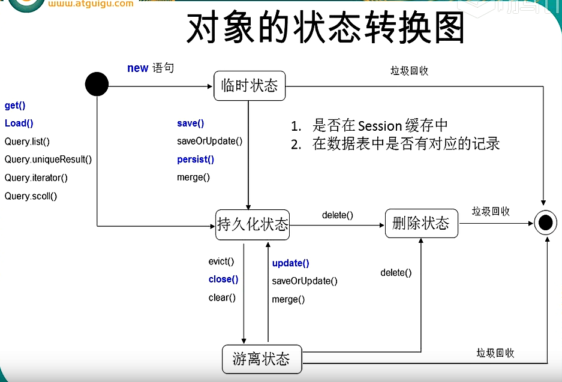
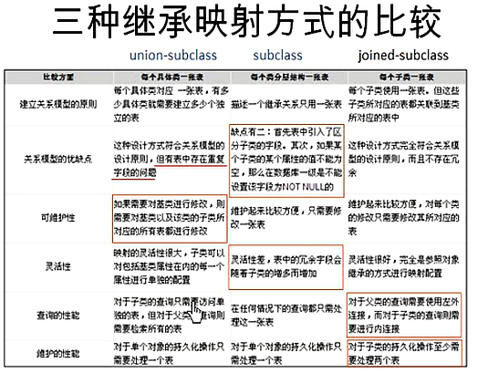
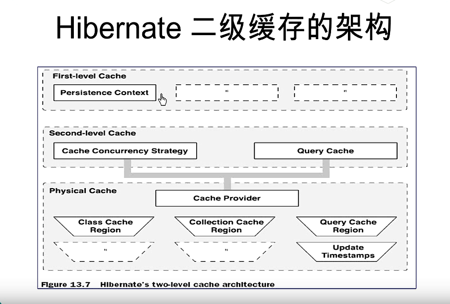

# 这个项目编写于2014年年末-2016年年初, 用来记录我学习JAVA,J2EE,JAVE WEB 开发的过程
# This project was written from the end of 2014 to the beginning of 2016. It is used to record my learning process of JAVA, J2EE, JAVE WEB development.

+ Platform: Eclipse

# JDBC+Hiberntate+Spring+Sping MVC +Mybatis 笔记
## <a name="jdbc"></a>JDBC

**JDBC :JAVA Application 连接数据库的规范.**

**JAVA App —————— JDBC API ——— 数据库厂商.**

1）要求编程人员按照这个规范来连接数据库

> *   a). 面向对象 接口|对象操作.
> *   b). 步骤 套路.
> *   c). 桥连接不需要掌握|目前都在使用直连接.

2）要求各大数据库厂商按照JDBC API   规范提供相应的驱动jar包

> *   常有类：在java.sql.\*: Connection  DriveManager PrepareStatment(Statment)  CallableStatment    ResultSet.


**UI ——— Servlet Filter JSP**

> *   Service —— 业务：验证，数据组合|拆分|格式化
> *   DAO(DataAccess)—-和数据库操作相关的事情
> *   UI —— Service   UI依赖Service：UI 创建Service对象

**MVC:**
> *   View:JSP CSS JS HTML
> *   Controller:Servlet Filter  Listener(Structs,Sping MVC)
> *   Model:Service +DAO

这两个架构是不同方面的划分，前者是代码结构的划分，后者是对于WEB   二者不是平行结构
—-student表的CRUD —-
Create  Read    Update  Delete
Service: new    remove  notify  get


**`在java.sql.*`** : 
**Connection connection** 数据库连接(这是一个加载类：调用该类static静态块代码，因为这个类的静态块中写了注册代码，即注册驱动)

**url：**统一资源定位符，要连接哪个数据库

**Oracle:** jdbc:oracle:thin@ip:1521:数据库用户名

**Mysql:** jdbc:mysql://ip:port/数据库用户名

**user：**数据库用户名       **password：**数据库密码

connection = DriverManager.getConnection(url,user,password)

Statment:

> 1). 不能写占位符即 “？”；
>
> 2). Statment 的级别较低，且性能较差

按名查询    按位查询
在地址栏中输入请求转发命令，servlet无法获取地址栏中传的参数


**泛型中参数使用问号表示使用所有类型**

**jdbc的批量操作：一次连接要执行多条语句。**

**1，批量操作怎么写：**

> *   a，对一张表执行多条语句。
> *   b.同时操作多张表。


**2.事务控制**
> *   a.操作多条语句的时候<br>connection.setAutoCommit(false)//设置手动提交<br>connection.commit()//在事务末尾进行提交<br>connection.rollback();//一旦事务中某一行发生错误，那么执行回滚操作<br>throw new Exception(e);//因为回滚操作也有可能会产生异常。
> *   b.当对多个表进行操作的时候。


**JDBC中多表操作控制事务的核心:** 只能在一个连接上去操作（每一次对数据库操作的函数都需要传入同一个连接），你才能控制事务。若不是一个连接则无法实现多表操作。
也应该对数据进行封装
可以用java来写 也可以用数据库的存储过程来写

模糊查询：1，首先模糊查询需要有一个条件—keyword


2015.7.24

SSH：structs2+Spring+hibernate

struct2:封装servlet filter

hibernate:数据持久化 —\>O-R映射 关系数据库———对象

spring：大集成者，IoC事务控制  反射    对DAO层再次封装Sping MVC 功能与struct类似 功能比较强大 模板化


SSI：struct2+Spring+iBatis(MyBatis)


Spring MVC+MyBatis+Spring(老师认为最好的组合)


**笔记主要是Spring MVC+Hibernate +SPRING   WebService**

> *   1) 对于框架的学习，要多查文档
> *   2) 对于框架的写法，较多尽量多接触不同的写法
> *   3) 框架的配置（properties文件 ——>XML文件——>使用注解写法进行配置）
> *   4) 现在Java Web流行的是**全注解写法** （hibernate 4.2之后不支持XML）：<br>全注解（JPA）+Maven（主要优点在构建工程，将jar包在工程外面使得程序更轻，<br>Maven   中有一个XML文件：功能是配置在网上自动下载工程所需的jar包——pom.xml jar包位置你  可以自己制定，想到与一个外部应用）
> *   5)  第一步先把框架用起来，借鉴他人使用框架的方法；


<br><br><br><br><br>


## <a name = "JPA"></a>JPA 创建的基本步骤:
在eclipse中创建JPA 项目，该项目会自动生成一个persistence.xml文件，在该文件中配置数据库和hibernate的相关信息。

***注意:*** persistence.xml 的名字不能进行更改且位置一定要在META-INF的目录下；

#### 1.  在persistence.xml文件中的


	    <persistence version="">
	        <persistence-unit name, transaction="">
	        </persistence-unit>
	    </persistence>

下配置各种信息。

其中，在 `<provider>` 标签下配置ORM产品

	    eg. hibernate
	    <provider>
	    	org.hibernate.ejb.HibernatePersistence
	    </provider>


并且在`<properties>`标签下配置数据库属性和hibernate的基本属性, 在 `<class>` 来添加持久化类

***注意:*** 在配置ORM产品(eg: hibernate)时，实际上是实现了**javax.persistence.spi.PersistenceProvider**接口的实现类并且若JPA项目下只有一个JPA的实现产品，也可以不进行配置。

#### 2. JPA的注解介绍:

在持久化类中:

**@Entity** 表示该类是一个实体化,具备与实体表的映射关系，只不过表名就是类名罢了  
**@Table(name="")** 指出关联的数据表的名字<br>
**用table来生成主键:** 将当前主键的值单独保存到一个数据库的表中，主键的值每次都从制定的表中来获得。生成主键需要使用两个注解:<br>
**@GeneratedValue(strategy = GenerationType.TABLE, generator = "")**<br>
 **@TableGenerator.** <br>
> *   其中*name属性*表示该主键生成策略的名称，与上面的generator 对应;<br>
> *   *table属性* 表示生成策略的持久化的表名; <br>
> *   *allocation*表示主键每次增加的大小，默认50<br>
> *   *pkColumnName*:在主键生成表中，该主键生成策略所对应的键值的列名称;<br>
> *   *valueColumnName:* 持久化表中，该主键当前所生成的值的列名称<br>
> *   *pkColumnValue:* 在持久化表中，生成策略所对应的主键(也就是表中pkColumnName列的具体的值)

<strong>在对应的get方法上使用对应的注解来映射组件和对应的数据类</strong>。<br>
	  其中`@GeneratedValue(strategy="") `生成组件的策略,其中最常用的策略是 `GeneratedTYPE-AUTO。另外IDENTITY` 表示数据库主键采用自增的方式来告知对应数据列的列名。并且在里面还可以指定 非空nullable, 长度 length等属性<br>
**@Id** 来映射主键ID。<br>
**@Basic**: 自动的将属性映射到数据对应的类，如果get方法前没有设置任何注解，系统会自动进行添加@Basic，只不过注解名就是表面。<br>
**@Transient:** 当某个属性不需要被添加到数据表中的一列的时候，可以加入@Transient表示这个属性不需要映射到数据表 来让系统忽略这个方法。<br>
**@Temporal:** 通过加入该注解来确定date类型(例如 time, timeStamp, date)进行属性映射时的精度。具体设置在该注解添加具体的TemporalType来指定。<br>

#### 3.  JPA API:
**Persistence类**: 用于获取EntityManagerFactory实例，其中包含一个createEntityMangerFactory的静态方法。 <br>
**EntityManagerFactory:** 与hibernate的sessionFactory对应，主要用来创建EntityManger实例。 createEntityManager 创建EntityManager实例<br>
**EntityManager:** :

*   find(): 类似于hibernate中的get(.class,位置); getReference(.class, 位置)类似于hibernate中的load()方法;<br>
*   prsist(): 类似于hibernate的save()，使对象由临时状态，变为持久化状态,但是与save()不同的是, <br>***注意:*** *若对象已经通过set方法设置ID，即ID已经存在，那么persist()不会执行INSERT方法,而会抛出异常。*
*   remove(): 类似于hibernate中Session的delete()，把对象对应的记录从数据库中删除。但是与hibernate不同的是该方法只能使用在持久化对象上，而不能使用在游离对象上。
+  merge(): 类似于hibernate的saveOrUpdate()
	-  若调用的对象为临时对象，则会创建一个新的对象并将临时对象的属性拷贝到新建的对象中，并将新建的对象进行持久化操作，调用INSERT命令
	-   若调用的对象为游离状态，即传入的对象有OID。
		+ 1.  此时如果entityManager没有该对象,数据库中也没有对应的记录,  JPA则会创建一个新的对象并将该游离对象的属性拷贝到新建的对象中，并将新建的对象进行持久化操作，调用INSERT命令。<br>
		+ 2.  此时如果entityManager没有该对象,但是数据库中有对应的记录，则JPA会在数据库中查询该记录并且返回一个带有查询结果的对象;并且将游离状态对象的属性赋予给该查询结果的对象，最后对该对象进行update操作。
		+ 3. 此时如果entityManager有该对象,JPA会把游离对象的属性复制到EntityManager缓存的对象中，EntityManager缓存执行update语句

*  flush():与hibernate中Session的flush()相同，强制将持久化上下文中所有未在数据库中保存的实体状态信息保存到数据库中。默认情况下，在提交事务的时候才会刷新缓存
*  refresh()：与hibernate中Session的refresh()相同,更新数据库的实例属性值

**EntityTransaction:** JPA的事务管理 ： *commit()* 提交事务，*begin()* 开始事务(需要先在entityManager中调用getTransaction()才可以使用而不能想hibernate一样直接进行beginTransaction操作)。*rollback()*回滚， *isActive()*查看事务是否为活动的(只有事务是活动的时候才能调用commit(),rollback())。

#### 4.JPA事务的生成步骤:
*   1) 创建

```
EntityManagerFactory EntityManagerFactory emf  =

Persistence.createEntityManagerFactory(persistenceUnitName(String))
```
其中persistenceUnitName 在对象的persistence.xml 中的 persistence-unit 标签中的name<br>

* 2) 创建EntityManager

```
EntityManager entity_manager =  
				EntityManagerFactory.createEntityManager;
```

* 3) 开启事务

```
EntityTransaction transaction = EntityManager.getTransaction();
transaction.begin();
```

* 4）进行持久化操作: <br>创建持久类 并进行set方法的操作 *EntityManager.persist(创建的持久化对象)*;
* 5）提交事务
* 6）关闭EntityManger: EntityManager.close();
* 7）关闭EntityManagerFactory: EntityManagerFactory.close();

#### 5. JPA映射关联关系
* a. **单向多对一的关联关系(ManyToOne):**在实体化类的映射其他对象的方法前添加**@ManyToOne** 来映射多对一的关联关系，使用<br>`@JoinColumn(name = "")`来映射外键，name来映射外键列的列名。<br>
与hibernate相同，保存多对一时，**建议先保存"One"的一端，后保存"Many"的一端。**<br>
在**查询时**查询"Many"时，会调用左外链接查询"One"和"Many"一端的数据。当在@ManyToOne中加入fetch=FetchType.LAZY信息时，启动懒加载来返回外键的代理对象。<br>
**在删除时(remove())**: 删除"Many"的一端没有问题，但是删除"One"的一端时由于有外键关联所以不能直接删除。

* **b. 单项一对多的关联关系(OneToMany):** 在实体化类的映射其他对象的方法前添加`@OneToMany` 来映射一对多的关联关系，使用`@JoinColumn(name = "")` 来映射外键，name来映射外键列的列名。<br>
**执行保存时**，一定会多出update语句，因为多的以端在插入时不会同时插入外键列。<br>
**在查询时**, 默认对关联的多的一端采用lazy懒加载的方式。
通用可以使用 `@OneToMany(FetchType.EAGER)`来修改加载策略，即 使用左外链接的方式进行加载。<br>
在执行**删除**时:若删除"One"的一端，JPA默认会把关联"Many"的一端清空,然后再删除。可以使用 `@OneToMany(cascade)`来修改默认的删除策略。

* **c. 双向多对一(双向一对多):** "one"的一端需要加入`@OneToMany注解`和`@JoinColumn`,"Many"的一端需要加入`@ManyToOne`注解和`@JoinColumn`, 并且两边的JoinColumn(即外键列名) 的name要一致<br>
**在执行保存操作时**，若先保存"Many"，再保存"One"默认情况下，会多出2n条Update语句;若先保存"One"的一端再保存"Many",会多出n条update语句。 ***所以建议使用"Many"的一端维护关联关系，而"One"的一方不维护关联关系，可以有效地减少SQL语句的数量.*** <br>
通过在注解里设置**`MappedBy="`**另一方名字"来放弃维护，将维护权交到另一端来减少多余的update语句。注意: 这时候需要删除@Column注解否则会抛出异常。

* **d. 双向一对一关联关系:** 在实体化类的映射其他对象的方法前添加 **`@OneToOne`** 来映射一对一的关联关系，使用`@JoinColumn(name = "")`来映射外键，*name*来映射外键列的列名，另外还要加*unique= true*来设置唯一约束。<br>
而另一端在实体化类的映射方法前加入`OneToOne注解`，这里建议再加入*mappedBy=true*属性来避免多余的SQL语句。此时,外键放在哪一端都可以。

	*  **在保存时**，先保存不维护关联关系的(即@OneToOne中含有mappedBy属性的)，后保存维护关联关系的。<br>
	*  **在查询时.** :
	    * 1.默认情况下,若获取维护关联关系的一方，则会通过左外链接获取其关联的对象。通过在注解中加入fetch=FetchType.LAZY 调整策略为懒加载。<br>
	    * 2.默认情况下,若获取不维护关联关系的一方，也会通过左外链接获取其关联的对象。但是，无论是否修改fetch属性，依然会再发送SQL语句来初始化关联对象。
**所以在没有维护关联关系的对象时，不建议将fetch属性设置为懒加载**<br>。
	    * 3.上两条都是基于外键的一对一关联关系，而基于主键的一对一关联可以使用**`@PrimaryKeyJoinColumn`**来进行配置。

* **e. 双向多对多关联关系:** 使用`@ManyToMany`注解来标注且必须有一方通过设置注解中的*mappedBy*来放弃维护，之后使用

	```
	@JoinTable (joinColumns 当前表的外键=
				{@JoinColum(name, referenceColumnName指向对应的列名)},
				inverseJoinColumns 关联的对象在数据表中的外键
					={@JoinColumn(name, referenceColumnName)}  )
	```
其中而另一端的`@ManyToMany`需要添加*mappedBy*属性。<br>
通过`@JoinTable`来创建一个中间表:

	* 1) 属性name 表示中间表的名字
	* 2) JoinColumns 映射当前类所在表在中间表中的外键; 其中 该属性中的name代表外键列的列名字, referenceColumnName指外键列关联当前对象的哪一个属性，即当前表中的哪一列。
	* 3) inverseJoinColumns 用来映射关联的类所在的中间表的外键。
对于关联的集合对象，默认使用懒加载的策略。无论是使用维护关联的关系的一方还是不维护关联关系的一方,他们的策略是一样的。即都使用懒加载。

#### 6. JPA中的二级缓存
在persistence.xml中添加二级缓存的配置，与hibernate xml配置一毛一样<br>。
同时还需要再在xml中配置二级缓存策略(注意:这个配置必须要放到前面配置的后面):


	 <shared-cache-mode>
	    ENABLE_SELECTIVE
	 </shared-cache-mode>

并在需要二级缓存的实体对象上添加**`@Cacheable(true)`**注解<br>
其中:
> * ALL: 所有实体类都被缓存
> * NONE: 所有实体类都不被缓存
> * DISABLE\_SELECTIVE: 所有标识@Cacheable(true) 都要被缓存
> * ENABLE\_SELECTIVE: 所有标识@Cacheable(true) 都不会被缓存
> * UNSPECIFIED: 默认值，JPA产品的默认值将被使用。

#### 7. JPQL:
**Java Persistence Query Language** 是一种对象化的查询语言。 与HQL类似同样可以通过Query 的接口封装执行select, update, delete语句

* Query = entityManager.createQuery(SQL 语句) //创建查询
* Query.setParameter(占位符位置, 参数)   //设置参数，注意，这里的占位符是从1开始的。
* Query.executeQuery() 来执行SQL的update和delete功能。
* Query.getSingleResult() : 获取单个参数
* Query.getResultList() 获得参数列表。**默认情况下**，若只查询部分属性，则将返回object[]类型的结果，或者是Object[]的list.也可以在实体类中创造对应的构造器，来返回实体的对象(必须还要建立无参构造器)。<br>
* createNamedQuery():首先在实体类中加入`@NamedQuery`注解 其中*name* 是后面在调用的时候需要用到的标识符，而*query*后面跟SQL语句的字符串 ***(注意: 如果在这里面不写select, update, delete和加入占位符会编译错误，但是时间上并不会影响运行)***<br>
	调用时候需要在`entityManager.createNamedQuery()`中加入上面的*name*标识符参数，之后与上面的查询一样调用`setParameter()和getResultLists().getSingleResult.`即可
* nativeQuery(): <br>执行本地sql操作。`entityManager.createNativeQuery()`*，后面与其他方法相同
* 如果在xml配置文件中启用了查询缓存，则可以通过调用`query.createQuery().setHint(QueryHints.HINT_CACHEABLE, true)`来使用hibernate的查询缓存<br>
		 在JBQL中可以使用*OrderBy* 和 *GROUP BY*聚集函数<br>
* JPQL 关联查询: 与hibernate的关联查询是一样儿一样儿的。同样，关联查询返回的是List <Object[]>,所以与hibernate相同，**建议使用迫切左外链接进行检索，并且用相应的对象进行存储而不是List。**
* 可以在SQL语句中加入JBQL的内建函数来实现不同的目的和功能。eg：upper，trim，lower ....

#### 8. UUID 与GUID 的区别在JPA中的运用：
* 对oracle来说差距不是很大，但是对于mysql来说：uuid产生数据格式为“XXXXX-XXXXX—XXXX”；而GUID则不会产生“-”
* oracle 如要id自增长 除了需要JPA的注解之外，还需要hibernate的注解 二者需要配对。因为JPA 5 不支持UUID的注解
* 注解标签除了可以写在属性上之外，还可以写到getter方法上。值类型与对象类型不同。以int与integer为例子：int的默认值为0，而intager 默认值为NULL
*  可以使用`@Cloumn（"cloumnDefination"）`来强制改变数据库的类型

<br><br><br><br><br>

## <a name="hibenerate"></a> Hibernate

**Hibernate**（是一个工具，实现。hibernate注解已经被废弃，现在用JPA的注解）：
如何让你简便的将Java程序中的对象自动持久化到关系数据库中。建了表hibernate帮你自动生成对象，同样建了对象hibernate会帮你自动建立对象

* hibernate 会自动帮你翻译成相应数据库的语言
*  JPA（JavaPersistentsAPI）:通过注解或XML描述对象-关系表映射关系，并将运行期的实体对象持久化到数据库中。是JAVA得一种规范。目的：1.简化java ee/se 对象持久化的快发工作 2.整合RPM，进行统一。
*  hibernate 有一个configuration 的接口。 之后会有一个SessionFactory会话工厂（创建会话的一个集合，即每一次和数据库的连接为一个session）;从SessionFactory 中拿出Session;
*  Transaction 事务（commit,rollback）:
		而hibernate是JPA的一种实现，而JPA是Hibernate的一种子集

* 游离状态：表中可能有对应的数据，但其对象不在Session中； 持久化状态:表中有数据，Session中有对象，且二者唯一对应。临时对象，既不在数据库也不在session且OID为空；
* 删除状态：曾经在Session缓存中,但现在应用程序不再使用，且数据库中没有与其对应的OID记录<br>

	

#### Session中的主要方法介绍
* ***save():***
	* 1.使一个临时对象变为持久化对象
	* 2.为对象分配id
	* 3.在Flush缓存时，会发送一条insert语句
	* ***4.在使用save()之前设置ID是无效的，调用Save方法后ID会自动被覆盖**
	* 5.在调用Save()后修改ID会抛异常，因为持久化对象的ID是不能修改的

* ***persist():*** 与save()效果一样，完成一个Insert操作，但是persist不允许开发者对ID进行任何人为的设置，即在使用persist之前就存在ID了若修改id会抛出异常而不是被覆盖

* **session中get与load的区别：**

	> * load找到数据，先返回数据缓存到SESSION中，当用户检索时会首先查询session中是否存在数据，若没有回到二级缓存查询数据,若二级缓存没有才会发起select去数据库查询。
	> * get找不到el组件则返回为空，而load找不到则会抛出异常；
	> * 而在session中，如果一个对象是NEW的那么session中的SaveOrUpdate方法会自动调用save ，若已经存在那么session会调用update方法；
	>
		>1. get方法会立即加载对象，load方法是延迟加载，即会先返回以代理对象，若不适用该对象，则不会立即加载
		>2. load方法会抛出 lazyinitalionException异常(通常会在初始化代理对象前就已经关闭了session对象时会抛出该异常)
		>3. 若数据表中没有对应的记录，Session也没有被关闭，同时需要使用对象时，get返回null（老师认为这更好，因为你可以自己判断）,load则会抛出异常<br>load throws ObjectNotFoundException(load不适用该对象时则没问题)
* update方法；使一个对象从游离状态变为持久化状态。

	> 1. 若更新一个持久化对象，不需要显式调用update方法,因为在Session.commit()是先执行Session的flush
	> 2. 若更新一个游离状态对象，则需要显式调用update方法
	> 3. 使用update方法需要注意的事情:
	>
		>* 对于游离状态：无论要更新的游离对象和数据表的记录是否一致，都会调用update()。与hibernate触发器一起使用的时候有可能会有问题, **在.hbm.xml的绑定类标签中将select—before-update属性设置为true即可解决这个问题(通常不建议设置)**
		>* 若对象在数据库中没有对应记录调用但还是调用update()的时候，会抛出异常
		>* 当update()关联一个游离对象是，若数据库中已经存在了对应OID的记录，则会抛出异常，因为在session缓存中不能有两个OID相同的对象

* create():  每次运行先删除旧表，再创建新表并进行update; 一般数据库的ID值是不能设置的，也禁止其他应用程序更改，在hibernate虽然可以设置，但是最好不要设置

* delete()：执行删除操作OID和数据表中的一条记录，就会准备执行delete()，否则会抛出异常。<br>
	**通过设置hibernate配置文件中的hibernate.use\_identifier\_rollback 属性为true 让对象再被session删除了，其OID被设置为NULL**
* evict():从session缓存中把指定的持久化对象移除
* Hibernate中的映射：java通过OID来判断一个表是否存在。
* Hibernate与触发器协同工作会遇到的问题:
	1. 触发器使得Session缓存中的持久化对象与数据库对应的数据不一致，
	2. Session的update()盲目的使用触发器，无论是游离状态对象的属性是否发生了变化

#### 映射Java的时间，日期类型：

* 1. 在Java中，代表时间和日期的类型包括:java.util.Date, java.util.Calendar。<br>此外JDBC API还提供了java.util.Date的三个扩展子类  java.sql.Date, java.sql.Time and java.sql.Timestamp 分别对应数据库中的Date,Time, Timestamp三个类型
* 2. 在标准sql中Date表示日期，Time表示时间， Timestamp表示时间戳，同时包含日期和时间信息。
* 3. 进行映射的方法：a. 因为java.util.Date是java.sql.Date, java.sql.Time and java.sql.Timestamp的父类，所以util.Date可以和这三种类型都对应
			b. 所以在设置持久化类的类型时设置成java.util.Date类型
			c. 可以通过xml配置配置文件中的property的type属性分别设置Time,Date,Timestamp


#### Hibernate中表之间的映射方式

##### 一对一：

一对一与一对多在表的结构上是一样的。一对一的关键是外键列与主键列合二为一
`OneToOne(mappedby，cascade)`其中*mappedby*只能映射对象名而不能写类名（类名的驼峰命名法）<br>
	*mapped by：* 在关联关系中，由外键所在对象来负责（主导）关联关系，mapped by所指定的表不负责.如果不写mapped by，hibernate会帮你创建一张中间关系表，所以在OneToOne的关系中mappedby必写！<br>
`@PrimaryKeyJoinColumn`
	第一次查询的时候先查主表，之后得到子表的主键。之后再查询子表。但是会有延迟加载时间的问题，从而导致整个查询的效率很低。

**对于hibernate的xml文件：**<br>

* 按外键映射： 给外键添加一个唯一约束。 一个表中用many-to-one 加一个外键，并加上唯一约束(unique=true)；另外一个表中加入one-to-one约束。

	> * 添加：建议先保存没有外键列的对象，这样会减少update的数量；
	> * 查询：
	>
		>* a.默认情况下，对关联属性使用懒加载
		>* b.同时提前关闭session也会出现lazyInitialization Exception
		>* *c.在one-to-one中(即没有外键的一端)需要添加property-ref属性来指定使用被关联实体主键以外的字段作为关联字段，否则hibernate会默认使用主键来进行管理，从而导致一些关联对应错误
		>* d.在查询没有外键实体对象时，使用的是左外链接，一并查询其关联对象并进行初始化。(了解即可)
* **按主键映射(推荐)**:一端的主键生成基于另一端的主键，自己并不会独立生成主键。即两端都使用one-to-one来进行映射，其中一端来增加contrained=“true”的外键约束，而另一端增加one-to-one元素映射关联属性<br>
其中一端在外键映射中使用<param>来设定参照的主键值，由于是主键映射，所以外键的设定应该在主键的里面来设定；使得当前主键增加外键约束。

##### 多对一的映射：

**在XML中：**

* 插入: 使用`<manyToOne 标签> name:`多对一端关联的属性的名字；<br>**class:**”One”那一端属性对应的类名；column: “One”在”Many”那一端对应的数据表中外键的名字<br>
	此时，若先Save()插入”One”，后插入”Many”只有Insert 语句，而先插入”Many”后插入”One” 则会额外产生update语句。原因是：后一种”one”的外键刚开始为空(即无法确定外键值)，
	之后等”One”插入后才会有外键值，所有会额外有UPDATE语句。故后一种方法效率较低
* 查询:

	> * 1. 若查询”Many”一端的对象，默认情况下仅查询”Many”一端的数据而不查询”One”一端的数据。这种现象称为原值加载
	> * 2. 在需要使用到关联对象时，才会发送对应的SQL语句。称为懒加载 lazy
	> * 3. 由”Many”的一端查询”One”的一端时Session已经关闭，默认情况下会抛出lazyInitialization Exception
	> * 4. 获取”Many”对象时，其关联的”One”对象默认是代理对象

* 删除:
		 **在不设定cascade关系的情况下，不能删除”One”一端**，因为”One”正在被”Many”所引用@ManyToOne    @JoinColmn(name=“”)其中name 不能用主表的主键数据是要生成的，但是无法有外间数据关系，关系维护应该一外键所在表（对象）为主导。

##### 双向一对多的映射：双向一对多=双向多一对一
**需要在”many”端定义一个”One”的属性，而在”One”的一端定义一个”many”端的集合属性(SET)**<br>

* 写集合时候需要啊注意的：

	> * 1. 需要把集合进行初始化操作，可避免空指针异常
	> * 2. 声明集合类型时需要使用接口类型，因为hibernate在获取集合类型时返回的是hibernate内置的集合类型而不是java SE中标准的集合实现。

* 多端同上使用`<manyToOne 标签>`,在一端需要通过写下面的代码进行映射

	```
	<set name, table>
	    <key column><key/>
	    <one-To-many class=one端的类 />
	</set>
	```

	> *  插入：无论先存One和Many的哪一端，都会有insert和update语句 而且先存Many时update语句相对较多。主要是因为One的一端和Many的一端互相都维护关联关系，所以会多出update。**可以通过设置set标签中的inverse来决定哪一方维护表之间的关系，true的一方为被动维护，而false的一方为主动维护。**通常在一对多的情况下设置Many为主控方有助于性能的改善。**若设为One的一端是主控会多出Update语句。建议先save One的一端。**
	> *  查询：
	>
	    >* 1. 查询时多Many一端的集合使用延迟加载
	    >* 2. 返回Many一段的集合是hibernate的集合类型，该类型具有延迟加载和存放代理对象的功能。
	    >* 3. 若调用前关闭session可能会抛出lazyInitialization Exception
	    >* 4. 在需要使用集合元素的时候set集合才会初始化。
	>
	>* `<set>`标签的cascade属性(开发时不建议使用，建议使用手工的方式进行添加，删除)：delete-orphan级联删除 其中save-update属性为级联保存
	>* OrderBy属性:select 查询的时候，orderBy会对集合中的元素进行排序。其中orderBy中使用的是表的字段名，而不是持久化类的属性名。OrderBy还可以加入sql函数


###### 多对多：
需要使用中间表来维护两表之间的关系
对于xml: 文件


	<set>
	    <key><column name=“”></key>
	    <many-to-many column name=“”></many-to-many>
	  </set>

使用上述结构来设置中间表。<br>
**其中many-to-many指定多对多的关联关系; column执行Set集合中的持久化类在中间表的外键列的名称.**

* 查询：需要连接中间表，它会进行内连接操作。同样支持懒加载的操作；<br>
	> * ***若两端互相manyToMany连接的时候，set的表名字必须一样，即都是中间表的表名。两端中 “key”的column与”many-to-many”的column是交叉相同的。**
	> * 其中key指的是当前端的外键名称，而many-to-many指的是对方端的外键名称，同时还要注意，需要制定一端为主维护端，即另一端需要设置inverse=“true”

* `@ManyToMany:` 缺点中间表不能新增属性，中间表的作用仅是维护其他两表之间的关系，且中间表不存在，但是该表不作为一个实体。<br>如果中间表除了原有属性还要新增属性的话@ManyToMany 不适用，此时需要两个一对多关系来实现多对多关系。


##### 自连接：
自己与自己的一对多。

* 组件映射：不是继承关系。是一个整体与局部的关系。所以在映射的时候只需要映射一张表即可。<br>涉及注解 @Embeddable @Embedded
* 继承关系:陈老师只讲了Single-table策略：只有一张表，表与类形成一对多的关系。即：一张表映射到整个类层次上面，这张表的列和类层次中的所有属性相对应。具体的子类代表的行有标识列来决定。这种映射策略在性能和简易性上都是优秀的。同时它也是表示多态的最好方法，不论是多态查询还是非多态查询都能工作的很好。因为陈老师认为后两种方法比较麻烦

##### Hibernate 的继承映射(了解)：

**subclass：**在对象的映射文件中 需要在父类添加**`<discriminate column>`**的标签设置辨别者列；需要在父类添加**`<subclass name, discriminate-value>`**和在标签内部设置**`<property>`**属性来进行子类的映射

* 插入:

	> * 1.对于子类对象只需要把记录插入一张数据表中
	> * 2.辨别者是由HIBERNATE自动维护的，开发者无需操心。
* 查询:

	> * 1.查询父类记录只需要查询一张数据表
	> * 2.对于子类记录，也只需要查询一张数据表
	> * 缺点:
		>* 使用了辨别者列，该列需要单独添加
		>* 子类独有的字段不能添加非空约束
		>* 若继承参差较多，则数据表的字段也会较多

**union-subclass:**将每个实体对象映射到一个独立的数据表中子类新增的属性可以有费用约束  不需要辨别者列<br>
使用 `<union-subclass name, table>`不需要外键,直接写自己的属性即可

* 插入: 插入性能好
* 查询: 查询父类会有子查询，需把附父表记录和子表记录汇总到一起之后一起查询，性能较差    子类查询性能较好

	* 优点:

		> * 1.无需使用辨别者列
		> * 2.子类独有的字段可以设置非空约束
		> * 3.映射方式较为简单，容易理解
	* 缺点:
		> * 1.存在冗余的字段；
		> * 2.进行update的时候由于存在冗余字段，所以update的查询语句较多，其中若更新父类的字段。更新的效率较低。<br>

**joined-subclass:** 每个子类有一张表，子类实例由父类和子类共同存储，需要每个子类表都使用key元素来映射共有主键，子类增加的元素可以添加非空约束使用<joined-subclass>来这是映射关系

* 插入: 对于子类记录至少插入到两张表中，即需要插入多张表。插入性能相对较差
* 查询: 查询父类记录，做一个左外连接查询; 对于子类记录，做一个内连接查询. <br>
	* 缺点: 查询性能相对较差
	* 优点:
		* 1.不需要添加辨别者列
		* 2.可以添加非空约束
		* 3. 没有冗余的字段


	


#### Hibernate的检索策略：
**Hibernate中共提供了三种检索方式：**

* HQL(Hibernate Query Language)、QBC、QBE(Query By Example)。

**数据库检索的目标**

* a.不浪费内存
* b.更高的效率:发送尽可能少的SQL语句

**检索方式：**

* **立即检索**(当程序加载一个对象是为了获得属性本身)：立即加载指定对象或逾期相关的对象，即要立即使用一个数据而无需等待. 立即加载检索方法制定的对象 lazy=false
* **延迟检索**(当程序加载一个对象是为了获得其应用，而不会立即使用属性的时候)：延迟指定对象或逾期相关的，首先创建起代理对象。即：只是映射数据的位置（不会生成Hibernate不会生成SQL语句），当用户需要的时候再进行检索。延迟加载查询子对象时候查询的次数为N+1次.<br>
延迟加载检索方法制定的对象，即使用具体的属性时再进行加载 lazy=true; 可能会出现lazyInitialization Exception。延迟检索仅返回OID值，其他仅是代理类的引用。
* **迫切左外链接检索：**通过左外连接来获取与其相关的对象。
	* **迫切左外链接：使用左外链接的方式进行查询并且把集合的属性进行初始化操作,list()里 面存放并返回的是实体对象的引用，可以用hashSet来去除重复的元素。**<br>
	* **左外链接(left join):list()存放并返回的使用一个对象数组类型，不能用hashSet的来取  出重复元素。根据配置文件来初始化数组**<br>
	* **迫切内连接(Inner join fetch): 不返回左表不符合条件的元素**<br>

**注：在真正发起检索数据的时候，session不能关闭，否则无法查到任何数据(会抛出lazyInitialization exception)**<br>

**检索策略作用的位置：**

* **类级别的检索策略(表)：** 默认情况下是延迟检索，但是延迟检索(lazy加载)仅对load有效，而get方法，HQL方法,QBC方法无效（它们采用立即检索)。`@Proxy(lazy=ture);`<br>    当`@Proxy(lazy=false)`时，即使是load方法也要立即检索。<br>
	**在XML中**可以通过`<class>`的 *lazy*属性进行设置。同样的lazy属性仅对load()方向有效，对于get(),HQBC均无效。
* **关联级别（一对一，一对多，多对多）**：**OneToXXX（OneToOne,OneToMany）**:在One的一方由于拥有Set集，故永远是延迟检索，在Many则是立即检索。
		left Join Fetch与left Join 的返回结构不同：left join 检索出来的表结构为平行；left Join Fetch 检索出来的表为层级结构
	* **一对多，多对多的检索策略:**lazy 决定set集合初始化的时机; fetch 取值select or subselect(子查询) 决定初始化set集合查询语句的形式;若取值为join则决定set初始化的时机，此时lazy属性将被忽略。

		* 1.一对多或多对多的集合属性默认使用lazy加载检索策略(即默认为true)，可以通过修改set的lazy属性来修改策略(不建议将lazy属性设置为false)
		* 2.set的lazy属性其实还可以设置为extra, 该取值会尽可能的延迟集合初始化的时机。当调用iterator()时会初始化，当调用size(),contain(),isEmpty()是会利用特定的sql查询查询必要的信息而不是整个信息。<br>
		*但是有些时候extra属性反而会使得在调用上述的三个方法时使用较多的SQL语句。所以大部分时候还是用true属性*
		* 3.对于set的batch-size属性: 设定一次初始化set集合的数量，可以有效减少select语句的数目从而提高效率。
		* 4.对于set集合中的fetch属性:

			> * a.默认值为select，通过正常的方式初始化set元素
			> * b.设置subselect 可以通过子查询的方式来初始化所有与set集合，此时lazy有效但是batch-size会被忽略。(决定many端集合的初始化时机)
			> * c.若取值为join时:在加载一的一端的对象时会采用迫切左外连接来检索Many端对象一端的集合属性，lazy属性会被忽略 HQL的query()的list()方法会忽略映射文件中的迫切左外连接而依旧用延迟加载策略。

	* **多对一，一对意的检索策略:**lazy 取值为proxy采用延迟检索，no-proxy采用无代理方式的延迟检索，false采用立即检索。

		* fetch： 取值为join，表示使用迫切左外连接的方式初始化many关联的一端属性，此时忽略lazy
		* batch-size: 该属性需要在一一段的class元素中，作用是一次初始化”一”的代理对象的个数
		* 补充内容：**`@ManyToOne OneToMany`** 默认是立即检索：若使用**@Fetch(FetchMode.SELECT), @LazyToOne(LazyToOneOption.FALSE)** 将ManyToOne变成延迟加载（N+1查询次数
			* 延迟检索：@LazyToOne(LazyToOneOption.PROXY)
			* 最好的写法

				> * a.先把他设置成延迟 主表：from 主表
				> * b.from 主表 a left join fetch 子表
* 最佳策略：
	> * 1.lazy=true fetch=select batch-size=5  此时你的所有语句无需考虑联合查询的问题
	> * 2.lazy=true fetch=subselect  此时你的所有语句同样无需考虑联合查询的问题。
	> * 3.lazy=true fetch=select 你自己很清楚的知道什么时候需要联合查询。

**这三种的特点：**返回的数据结构返回的都是LIST(主表)， 一般leftjoin与innerjoin使用频率最多<br>
**注意:** 如果你需要表与表之间为平行结构，与延迟已经没有太大关系


##### HQL检索方式:
Hibernate Query Language一种面向对象的查询语言

* **a. 查询步骤：**

	> * 1.通过Session的createQuery() 创建一个对象
	> * 2.动态绑定数据
	> * 3.调用Query方法的相关查询语句
	**注意：**动态绑定时Query接口支持方法链的编程风格(即多次调用set方法)，且setXX()方法返回自身实例而不是void<br>
	> * 4.查询时，参数的传递方式:
		* 按位置(通配符)查询：**属性名= ？ setXXX（位置，值）。**  *注意：位置从0开始*。
		* 按形参名字查询的时候  **属性名= ：形参 setXXX（”形参名”，值）。** *注意 等号与冒号之间有空格。*
*  **b. 分页查询:**
	* setFirstResult(int firstResult):从哪一个对象开始检索
	* setMaxResult(int firstResult): 每次最多可以检索多少条
	* 不同厂商的数据库对于: 分页查询发出的SQL是不一样的

		> * Oracle ——\>翻译 —-\>rownum
		> * MySQL  —-\>翻译 —-\>Limit 3，3

* **c. 命名查询:** Hibernate 允许在映射文件中定义字符串形式的查询语句，需要在xml文件中进行配置:添加**`<query>`**元素用于定义一个HQL查询语句，它与**`<class>`**元素并列。<br> 在程序中通过Session中的getNamedQuery()方法查询来获取对应的Query对象。

	```
	     eg:
	         <query name=“”>
	             <![CDATA[SQL语句]]>
	         </query>
	```

* **d. 投影查询**: 查询结果仅包含部分属性(通过SELECT语句事项);Query的list()方法返回集合中包含的数组类型的元素，每个对象数组代表查询的是一条记录。<br>可以在持久化类中定义一个对象的构造器来包装投影查询所返回的记录。
* **e. 报表查询:** 利用聚集函数，groupBy 和HAVING来进行查询
*  命名HQL事务写法相当于把HQL语句抽到一个统一的地方配置，然后取一个别名。在查询的时候使用session.getNameQuery(别名)

##### Hibernate的QBC(Query by Crteria)查询:
与传统SQL相比的优点: 检索条件较多，操作数量大,而SQL Query 是Query得子接口：平台移植性较差。

**通过Session.creatCriteria()来创建查询.**

**查询步骤:**

* 1.创建一个Criteria对象
* 2.添加查询条件: QBC中使用Criterion来表示，Criterion可以通过Restriction类的静态方法得到Criterion.add(Restriction.静态方法)
* 3.执行查询。

	> * **Criterion.uniqueResult**<br>利用**`Conjunction conjunction = Restriction.conjunction`**方法可以实现SQL语句的"and"，其中通过Conjunction生成的对象还可以添加另外的Conjunction对象(conjunction.add())
	> * 利用Disjunction disjunction = Restriction.disjunction方法可以实现SQL语句的"or",同样Disjunction对象同样可以添加另外的Disjunction对象。(Disjunction.add())<br>
	此外使用Restriction 的**MatchMode**可以完成类似于SQL中的LIKE的字符匹配。
		>* MatchMode.START：字符串在最前面的位置.相当于"like 'key%'"
		>* MatchMode.END：字符串在最后面的位置.相当于"like '%key'"
		>* MatchMode.ANYWHERE：字符串在中间匹配.相当于"like '%key%'"
		>* MatchMode.EXACT：字符串精确匹配.相当于"like 'key'"
		例如：使用QBC实现动态查询:


```
public List findStudents(String name,int age){

	Criteria criteria =   session.createCriteria(Student.class);
	if(name != null){
	criteria.add(Restrictions.liek("name",name,MatchMode.ANYWHERE))
	}
	if(age != 0){
		criteria.add(Restrictions.eq("age",new Integer(age)));
	}
	criteria.addOrder(Order.asc("name"));//根据名字升序排列
	return criteria.list();
}
```

* QBC的统计查询: 使用Projection的静态方法来进行统计查询对象。
* QBC的查询排序操作: 通过addOrder(Order.asc("")-升序, Order.desc("")降序)
* QBC的排序查询: 利用Criteria.setFirstResult 和Criteria.setMaxResults 来设置页开端和每一页的大小
* 利用QBC 进行数据库的原生查询: 通过**`Query query =session.createSQLQuery("SQL字符串");`** 来进行数据库原生的sql语句查询。之后通过**`Query.executeQuery();`**来执行sql语句
* QBC的分页查询: 在QBC中可以使用createCriteria()来进行行数的检索，与HQL相同，QBC同样可以使用setMaxResult(int i), setFirstResult(int i)来限制检索的行数。

	```
	eg:
	    setFirstResult((Paper.getPageNO - 1)*pager.getPagerSize());

	    setMaxResult=paper.getPagerSize();
	```
* 在QBC中 MatchMode.EXACT 精确匹配字符。MatchMode.ANYWHERE 任意位置匹配；MatchMode.START 以匹配字符开头；MatchMode.END 以匹配字符结尾；
**Hibernate的官方文档中有对QBC的详细介绍**


##### Hibernate中的事务管理：
* 悲观锁(pessimistic)：在读取把数据进行加锁，知道事物完成该锁被释放。但是在实际生活中很少用到。
* 乐观锁（optimistic lock）：后面加一个字段——version 通过version来控制数据。 一般用于公用数据，有些表完全没有必要使用锁。而且含有version字段的数据一般都与钱有关；
* 在hibernate中可以使用@version注解的方式，来进行加锁。
	* 支持类型：
		*  1）Integer
		*  2）Date
	 其中对于integer类型，很多数据库都可以使用，但是对于Date类型很多数据库不支持，比如oracle支持，但是mysql不支持。所以老师建议当你拿不准这个数据库的时候统统使用integer类型。

#### Hibernate的缓存：



**要求掌握一级缓存的理解，二级缓存的使用。**

* **一级缓存是session级别的缓存**，它是事务范围的缓存。这一级别的缓存由hibernate管理，一般情况下无需进行人工干预。
* **二级缓存：是有SessionFactory级别的缓存**，它是属于进程范围或集群范围。二级缓存既可以放到内存中也可以放到磁盘中，他需要人工通过编写代码的方式对其进行干预。

	**系统首先访问session的一级缓存，如果没有内容，再访问二级缓存。**

* **二级缓存的作用：**即使在使用中关闭了session缓存，也要保证SQL语句仅运行一条，即避免重复的SQL语句的产生。
	* **注意:**二级缓存不是在什么情况下都可以使用：很少修改的数据；不是很重要的数据，允许出现偶尔并发的数据；不会被访问的并发数据；参考数据；
* **二级缓存的并发策略**(与数据库的四个隔离级别一一对应): 非严格读写(Non-strict-Read-Write),读写型(Read-Write推荐),事务型(Transaction),只读型(Read-Only 即 Serilazation)

**集合级别的二级缓存:**

* 1. 在XML中通过设置\<collection-cache usage, collection\>
* 2. 在collection属性的末尾加入"类.集合名"代表设置集合属性为二级缓存，
* 3. 还要配置集合中的其他类元素对应的持久化类为二级缓存
* 4. 也可以在.hbm.xml进行配置

**EHCache：**
**二级缓存的使用需要依赖第三方缓存框架**，hibernate默认使用***EHCache***,使用最多的是EHCache。依赖**ehcache-core.jar  hibernate-ehcache.jar** 两个架包

* 对于ehchche的XML文件，如果对于属性不了解使用默认（default）就可以了.之后写上目标文件的位置，(XML文件在官方文档/project/etc/ehcache.xml)
* 使用ehcache的时候需要使用@cacahe标签
* 也可以在Hibernate的XML配置文件中:
	> * 首先要启动缓存:


		<property name="cache.use_second_level_cache">true<property>


	> * 之后加入


		<property name="hibernate.cache.region.fractory_class">
		org.hibernate.cache.ehcache.EhCacheRegionFactory
		</property>


	> * 并且还要在XML中添加


		<class-cache usage = "上述的四个并发策略" class="包名+类名">
		(也可以在.hbm.xml中进行配置)


	* Ehcache 配置文件:

		> * **`<diskStore path=""> :`**指定一个目录，当Ehcache把数据写到磁盘上的时候，把数据写到这个目录下。
		> * **`<defalutCache>`**:默认的数据过期策略。
		> * **`<cache name="">`**:设定具体的命名缓存的数据过期策略，其中每一个命名缓存代表着一个缓存区域。缓存区域(region): 一个具有名称的缓存块，可以给每一个缓存区域设定不同的缓存策略.<br>
		> * **如果没有设置任何的缓存区域，那么被缓存的所有对象都会使用默认的缓存策略(<defalutCache>)**
			>* name属性: 设置缓存的名字
			>* maxInMemory属性:设置基于内存的缓存中可存放的最大对象数目
			>* eternal属性: 设置对象是否为永久的,true表示用户过期。此时忽略 timeToIdleSeconds 和 timeToLiveSeconds 属性，默认为false。
			>* timeToIdleSecond属性: 设置对象的最长空闲时期，以秒为单位，超过这个时间对象过期，当对象过期时Ehcache会把这个对象从缓存中清除，如果为0，代表这个对象可以无限期的处于空闲状态
			>* timeToLiveSecond属性: 设置对象的最长生存时间，超过这个时间，对象过期。如果为0，代表这个对象可以无限期的存在于缓存中。该属性必须大于或等于 timeToIdleSeconds的属性值
			>* overflowToDisk属性:设置基于内存的缓存中的对象到达上限后，是否将基础的对象写入基于硬盘的缓存中。
* Ehcache 的命名方法:

	* Hibernate在不同的缓存区域保存不同的类/集合
	* 对于类而言: 区域的名称是类名 即: 包名.类名
	* 对于集合而言:区域的名称是类名+属性名 即: 包名.类名.属性名

* Ehcache的查询缓存: 默认情况下，设置的缓存对于HQL和QBC是无效的。可以通过调用`query.setCacheable(true)` 来设置查询缓存。<br>
	> 并且要在xml文件中加入


		<property name="cache.use_query_cache"></property>


	> 来声明开启查询缓存。<br>
	> **注意:** 查询缓存是依赖于二级缓存的。更新时间戳缓存(UpdateTimeStampCache): 主    要用于存放对于查询结果相关的表进行插入，更新，删除操作的时间戳。Hibernate通过时间   戳区域来判断查询结果是否过期。<br>

	> * 更新时间缓存的过程:
	>
		>* T1时刻 执行查询操作，并将结果放入QueryCache区域
		>* T2时刻 对查询结果相关的表进行更新操作，并放入UpdateTimeStampCache区域
		>* T3时刻 首先判断T1,T2的大小。若T1<T2 则丢弃QueryCache的查询结果并重新查询数据; 若T1>T2 则直接从QueryCache中获取查询结果
		>* **注意:** T1,T2无时间前后的关系(了解即可)


**Hibernate 管理SESSION对象生命周期的方法：**

* 1. Session对象的生命周期与本地对象绑定
* 2. Session对象的生命周期与JTA(Java Transaction API)事务绑定
* 3. Hibernate委托程序来管理Session对象的生命周后期

**Hibernate 的批量操作:** 推荐使用JDBC原生的API进行操作，效率最高，速度最快


<br><br><br><br>


## <a name="Spring"></a> Spring
Spring 相对于EGB是轻量级的框架，针对structs和hibernate的兼容性的支持。并且同意解决事务的问题；

**Spring采用依赖控制，他的实现方法是控制反转：**

* 类与类（对象与对象的关系：依赖）A对象完成自己的功能（业务），需要关联依赖其他对象B的功能，之后会在A中创建B对象。调用B对象的方法（功能），和A的功能组合在一起完成自己的功能。<br>
* spring中A依赖B控制权由业务所依赖的对象转到spring的外部容器，由容器强行注入。目前容器启动之后会自动注解。

Spring Construction：

#### XML配置步骤：

* a. 加入Jar包:将 common-logging.jar    Spring-beans-X.X.RELEASE.jar    Spring-Context--X.X.RELEASE.jar     Spring-core--X.X.RELEASE.jar    Spring-expression--X.X.RELEASE.jar
* b. 建立Spring Bean Configuration 配置文件
* c. 在配置文件里配置bean


		<bean id="" class= "包名.类名"(需要映射的实体类的位置)>
		这里的标识符id是唯一的
		<property
			name="该实体类中对应的setXXX方法，set之后的值，
			并将首字母小写" value = "给name赋的值">
		</property>
		</bean>


	> * **字面值:**可以通过字符串表示的值，通过`<value>`元素或value属性进行注入，当包含特殊字符  的时候可以使用`<![CDATA[]]>`将该特殊字符包裹起来。
	> * Bean之间的引用:


		<bean id="" class= "包名.类名"(需要映射的实体类的位置)>
		    <property
		    	name="set方法中引用类型的名字"
		    	ref="需要引用的实体类的<bean>的id值">
		    </property>
		    <property name="set方法中引用类型的名字">
		        <ref bean = "需要引用的实体类的<bean>的id值"/>
		    </property>
		    <!-引用内部bean，
		    	内部bean只能在内部使用而不能被外部调用 没有必要写id-->
		    <property name="">
		        <bean class = "">
		            <!--属性注入-->
		            <property
		            	name="该实体类中对应的setXXX方法，
		            	set之后的值，并将首字母小写" value = "给name赋的值">
		            </property>
		            <!--构造注入-->
		            <constructor-arg value = "" index= """ type =""" >
		            </constructor-arg>
		        </bean>
		    </property>
		</bean>

* d. 在需要用到spring的地方配置：
	* 1) 创建Spring的IOC容器对象 :

		```
		ApplicationContext ApplicationContext =
		new ClassPathXmlApplicationContext("第二步建立的XML文件名");
		```
	当然ClassPathXmlApplicationContext 的参数也可以是.class，但是同一个Class中只   能有一种Bean，所以没有上面的参数灵活<br>
	创建容器的时候，Spring会调用Entity构造器对该类进行初始化，并对 **`<bean><property>`**中的set方法进行初始化。<br>
	* Spring中提供了两种的IOC容器的实现:
		>* BeanFactory: IOC容器的基本实现，是Spring框架的基础设置，面向Spring本身
		>* ApplicationContext: 是BeanFactory的子接口，面向Spring的开发者使用，几乎所有场合都是在使用ApplicationContext而不是BeanFactory。<br>**其中ApplicationContext在初始化上下文时就创建了XML的Bean对象实例。**
		>* 实现类:
		>
		    >* ClassPathXmlApplicationContext   从类路径下加载XML配置文件
		    >*  FileSystemXmlApplicationContext 从文件系统中加载XML配置文件
		>* ConfigurationContext: ApplicationContext的扩展，新增refresh(), close()方法。使得ApplicationContext具有启动、刷新、关闭上下文的能力

	* 2) 从IOC容器中获取Bean实例

		```
		Entity = ApplicationContext.getBean("XML文件中<bean>的id值");
		```

	* 3) 调用实例中的方法
	* 4) 在Entity类中必须要有一个无参数的构造方法。

#### 基于注解的方式的配置步骤:
* a. 在XML文件中导入context的命名空间并且加入**`<context: component-scan>`** 来进行Bean扫描。<br>
	* 其中**base-package**属性制定一个需要扫描的基类包, Spring会扫描这个包下的所有类，当需要扫描多的包的时候用逗号隔开
	* resource-pattern 来设置指定扫描的资源，而不是全部
		* **`<context: include-filter>`**子节点表示要包含的目标类
		* **`<context: exclude-filter>`**子节点表示排除在外的目标类

		```
	eg.<!--制定Spring IOC容器的扫描的包-->
		<context: component-scan
		    	 base-package = ""  resource-pattern = "">
		 	<!--若想让 <context: include-file>生效，
		   	 需要在<component-scan>将 use-fault-filters = "false"-->
			<context: include-filter
			按照注解来识别只需要包含哪些类，其他的不行;
		       	 type = "annotation"
		         expression = "使用该注解所需要的的import 类路径”>
			<!--使用assignable的方式过滤-->
			<context: include-filter  type = "assignable"
					expression = "需要包含的类路径">
		        	<context: exclude-filter> 同理
		</context: component-scan>
		```
对于扫描到的组件，Spring有默认的命名策略相当于<bean>的 id值，使用非限定性类名且首字母小写(例如类名交给User,那么spring就会扫描是否有"user"的类)<br>
**此外，也可以通过标识注解中的value属性来设定名称**

* b. 在需要被扫描的Bean类前加入Spring注解，来标识这个类是要被扫描的
	* **`@Component`** 基本注解，表示一个受Spring管理的组件  @Respository 标识持久层  @Service 调试服务层(业务层)组件
	* **`@Controller`** 标识表现层的组件
* c. **`<context: component-scan>`**会自动注册 AutowiredAnnotationBeanPostProcessor实例，该实例会自动装配 **@AutoWire, @Resource, @Inject的注解属性**：
	* 1). `@AutoWire` 注解 自动装配与当前bean具有关联关系的已经在IOC容器中创建的其他Bean 和 set方法。<br>默认情况下如果在需要自动装配的Bean或方法前加入`@AutoWire`, IOC容器会自动将该Bean 和 set方法进行装配。<br>如果需加**@AutoWire Bean**或方法在IOC容器中并没有被声明，那么在`@AutoWire()`将require属性置为false即可。
	*  2). 当IOC容器中有很多个相匹配的Bean的时候(例如: `@AutoWire`接口，而该接口有多个实现类), IOC容器会默认装配Bean的名字与`@AutoWire` 的名字一样的Bean。

		> * 解决方法：
		>
			>* i. 在那个需要被自动装配的Bean的扫描注解上(例如: `@Component`) 设定与@Autowired自动装配的属性名一致即可<br>例如:` @Autowired` 接口名字叫 PersonInterface （Student,Employee)都实现改接口。<br>若想要@Autowired PersonInterface 自动装配Student，那么就需要把Student 中@Component注解的Value 设定为 "PersonInterface"
			>* ii.在@Autowired 的下面添加一个 `@Qualifer(value ="")`注解,并将该注解的value值设为你想要自动装配的类的类名(首字母小写)即可,<br>此外还可以加到set方法上或者是入参列表中。<br>
			**例如** 想要装配 实现PersonInterface 的Student 那么应该写成**@Qualifer("student")** 即可 **set方法: setPersonInterface( @Qualifer("student") PersonInterface personInterface)**
	* 3). `@Autowired` 也开始装配到数组类型的属性上，此时Spring会把数组里的所有Bean进行自动装配<br>当`@Autowired`装配到集合中的时候，Spring会读取该集合类的信息，然后把类型兼容的Bean都匹配上。其中Map上 Spring会把Bean的名字作键，Bean的内容做值
	* `@Resource, @Inject`的功能类似，一般建议使用`@Autowired`


#### Spring中 Bean
* IOC(Inverse of control): 容器主动的将资源推送给它所管理的组件中，而该组件会选择一种合适的方法接受资源。即在运行期，由外部容器动态地将依赖对象注入到组件中

* DI(Dependency Injection): **IOC的另一种表现方式**。组件以预定好的方式来自容器的资源注入(eg: setter方法) 即应用本身不负责依赖对象的创建及维护，依赖对象的创建和维护由外部容器所完成

* Spring中支持三种依赖注入的方式:
	* a. 属性注入： 通过Setter方法对Bean的属性值和引用进行注入，这种注入方式是开发里面最常用的注入方式
	* b. 构造器注入: 需要使用`<constructor-arg>`元素里进行声明，且`<constructor-arg>`中没有name属性。
		> * 首先要在Entity类中创建一个带参数的构造方法
		> * 之后在XML配置文件中加入

		```
		<!--这里的标识符id是唯一的 -->
		<bean id="" class= "包名.类名"(需要映射的实体类的位置)>
			<!-- <constructor-arg>标签可以有多个，
			并且顺序是要按照Entity中带参构造函数的参数顺序 -->
		  	  <constructor-arg value = ""></constructor-arg>
		    	<constructor-arg value = "" index= type = >
		   	 </constructor-arg>
		    <!-- 也可以通过Index属性来设定参数顺序，
		    	type来设定参数类型.当有多个带参构造方法的时候，
		    	可以指定参数的位置和参数的类型以区分重载的构造器 -->
		    <constructor-arg type = "">
		        <value>属性值</value>
		    </constructor-arg>
		</bean>
		```
	* c. 工厂方法注入(不推荐)
		* Spring支持级联属性的赋值`<property name="bean_id.引用属性名"></property>` 属性需要先初始化，后才能被级联属性所赋值
		* 配置Bean的集合属性:

			```
			<bean id="" class="">
			    <property name="">
			        <list>
			            <ref bean="">
			            <value></value>
			        </list>
			    </property>
			    <property name="">
			        <set>
			            <ref bean="">
			            <value></value>
			        </set>
			    </property>
			    <property name="maps">
			        <map>
			            <entry key="" value=""> </entry>
			            <entry key="" value-ref=""> </entry>
			        </map>
			    </property>
			    <property name = "">
			        <props>
			            <prop key = "">value</prop>
			            <prop key = "">value</prop>
			        </props>
			    </property>
			</bean>
			```

		当配置独立的集合bean，便于多个bean对集合进行引用时需要导入`<util: set><util:       properties><util: list><util: map>`和 命名空间`<ref bean="">` <br>还可以通过p 命     名空间对bean的属性进行赋值，不过需要先导入p 命名空间。这种方式相对于以前的        bean配置方式相对简洁一些。<br>
		例如: 一个Person实体类中有 name(String), age(integer), Car(一个类的引用)
		在xml中可以利用P 命名空间对该类进行配置:


			<bean id= "" class="包名.Person"  
				p:name=""
				p:age=""(给普通变量进行赋值)
			        p:car-ref = "" (给引用变量进行赋值)> </bean>

#### Spring中的自动装配 （AutoWire）
* Xml中配置自动装配:
	在`<bean >`中的**autowire**中制定自动装配的模式, 注意在自动装配byName的时候，进行自动装配的Bean类中必须要有被自动装配的Bean类的setXXX方法
	> * ByName:必须将目标bean的名称与属性名设置的完全相同<br>
		即bean的id值必须要与这个bean所对应的实体类中的setXXX属性名的XXX一致,如果有匹配的，则进行自动装配，否则就为null。

		<!--若在xml文件中已经有<bean>配置了其他的类，
		而这些类在配有<autowire ="ByName">
		的bean类中刚好有setter风格的方法。
		并且这些类在IOC容器的id与而这些类在配有
		<autowire ="ByName">的bean类中刚好有setter方法名一致的话，
		这些类就会被自动装配 -->
		<bean id= "" class="包名.类名"
			p:param=""
			p:param-ref  autowire="ByName"></bean>


	> * ByType: 根据bean的类型当前bean的属性的进行装配，但是当IOC容器中有多个目标与要配置的Bean类型一致时，不能进行自动装配的操作

		<!--若在IOC容器中配置的bean类恰好与
			<autowire ="ByType">的bean类中属性类型一致，
			那么这些IOC容器的bean就会被自动装配-->
		<bean id= "" class="包名.类名"
			p:param=""
			p:param-ref  autowire="ByType"></bean>

	> * Construcor: （不推荐）
		* 缺点:
		    1. 由于AutoWire是bean级别的，所以一旦使用AutoWire的话，就会为当前bean的所有属性都必须使用自动装配
		    2. 一旦指定了autowire的ByName or ByType的时候，要么只能根据名字要么只能根据类别，而不能兼而有之。所以自动装配的方式不够灵活

#### Bean之间的关系
* Bean配置的继承:
	* 1). 使用`<bean>`的`parent=""`属性, 使用哪一个bean作为当前bean的父bean。<br>
		同时子bean也可以覆盖父bean已有的属性
	*  2). bean配置的模板:
		*  a. 在`<bean>`中设置 abstract="true" 让这个bean变为抽象bean 即模板bean。与抽象类类似，抽象bean不同在IOC容器中被实例化, 只能被其他的`<bean>`调用 parent方法所继承，在继承时abstract="true" 不会被继承
		*  b. 如果一个`<bean>`的class 没有指定， 那么这个bean必须是一个模板bean ，即必须加上abstract="true"
* Bean中间的依赖关系: 当配置一个类的bean的时候，必须要依赖于其他bean才能完成配置 这种现象被称为bean之间的依赖关系<br>
	通过在`<bean>`中设置 `depends-on = "其他bean的id"` 属性来设置与其他bean的依赖关系被依赖的bean称为前置bean。<br>
	前置bean会在本bean实例化之前创建好。  当依赖多个bean的时候可以通过逗号，空格的方式来配置Bean的名称

#### Spring Bean的作用域:

通常的bean是单例的，即当调用的bean id相同，返回的是同一个bean。<br>
可以在`<bean>`设置属性 scope = "" 来配置该bean的作用域

> * 其中:singleton 单例(默认):整个生命周期仅每个bean id仅创建一个bean，在初始化IOC容器时被创建
> * prototype 原型:每次想IOC容器获取bean的时候，都会产生一个新的bean

#### Spring使用外部属性文件:

* a. 在Spring 配置文件里加入 context 的命名空间
* b. 加入`<context: peoperty-placeholder  location="classpath: 文件路径">`
* c. 利用 `${变量名}` 的方式使用外部属性文件的属性

#### SPEL(Spring Expression Language):
 支持运行时查询和操作对象的表达式语言,可以为bean进行动态赋值<br>
同时还可以实现通过bean 的id实现对bean的引用，调用方法以及引用对象的属性， 计算表达式的值， 正则表达式的匹配<br>
使用**#{}** 作为界定符

* a. 为字面值进行赋值(不推荐): `value = "#{5}" value = "#{89.7}" value = "#{true}" value = "#{"hahaha"}"。
`* b. 引用bean的属性，方法: 通过T()可以调用类中的静态方法，此外SPEL还支持算术运算，正则表达式等

		eg: value = "#{ T(java.lang.Math).PI * 50 }"


	通过**#{其他bean的id}** 来引用其他的bean;    **#{其他bean的id.方法}**来引用其他的bean的方法。

		eg: #{car}, #{car.brand}, #{car.price >30000 ? 金领 : 白领}


#### Spring管理的Bean的生命周期:
*  一般bean的生命周期是从IOC容器创建是开始调用bean的初始化方法，为属性赋值，容器关闭时结束并调用bean的销毁方法。
* 可以在`<bean>`中设置 **init-method ="init-id"** <br> **destroy-method ="destroy-id"** 来设置bean生命周期的开始和结束的标识符。
* Bean的后置处理器: 允许在调用bean的初始化方法前后对bean进行额外的处理，并且对IOC容器中的所有Bean实例进行逐一处理需要实现BeanPostProcessor接口, 并且实现 **postProcessAfterInitialization(Object bean, String bean\_name), postProcessBeforeInitialization(Object bean, String bean\_name)**这两个方法并进行相应的策略处理<br>
	* 其中 **bean**表示 Bean实例本身;   <br>**bean\_name:** IOC容器中配置bean的名字;<br>**返回值:**实际上就是返回给用户的那个Bean。<br>
	* **注意:**可以再以上的两个方法里修改返回的Bean实例，甚至是返回一个新的Bean实例,并把该后置处理器类在xml中`<bean>`进行配置,*注意这里的bean不需要设置id属性*。<br>IOC容器会自动识别BeanPostProcessor。

#### 通过BeanFactory 配置Bean:
* 静态工厂方法: 直接调用某一类的静态方法就可以返回Bean的实例
	 现在类中定义一个static静态方法 例如:`public static void getCar(String name)`
	 通过静态工厂方法配置bean，注意这里是配置bean实例而不是静态方法实例。

	```
	<bean id = "" class = "指向静态方法的全类名(包名.类名)"
		factory-method = "指向静态工厂的静态方法名
						例如:刚才定义的getCar">
	    	<constructor-arg value = "传入的参宿"></constructor-arg>
	   	 <!-- 如果静态工厂方法要传入参数，
	   	 	那么就需要使用constructor-arg来传入参数-->
	</bean>
	```

* `FactoryBean` 配置Bean: 有时候我们还需要再IOC容器中还需要用到其它实例，那么就适合用`FactoryBean`来配置
	>* 1. 创建`FactoryBean` 的类，并且实现` FactoryBean<Object>`接口<br>
	>* 2. 重写 `Object getObject();` 返回一个实例 <br>  `Class <?> getObjectType()` 获得对象的类型，返回一个.class文件 `boolean isSingleton()` 是否是单例<br>
	>* 3. 在XML配置文件中 配置`FactoryBean` 的`<bean>`实例，其中class指向`FactoryBean`的全类名 而`<property>`指向`FactoryBean`的属性，但实际上却返回的是`FactoryBean` 中的getObject方法中返回的实例<br>
	>* 4. 在IOC容器中调用 在XML中`FactoryBean` 的`<bean>`实例<br>

* 实例工厂方法:
	* 实例工厂的方法，先需要创建工厂本身并且在无参的构造函数里初始化数据，再调用工厂的实例方法来返回Bean的实例<br> eg. `public void getCar(String name)`
	* 在XML文件里配置工厂的实例

		```
		<bean id ="eg: carFactory" class="" ></bean>
		```
	* 通过实例工厂方法类配置实例

		```
		    <bean id =""
		    	factory-bean="指向实例工厂方法的Bean eg.carFactory"  
		    		actory-method = "指向工厂的方法 eg. getCar">
		        <constructor-arg value = "传入的参宿">
		        </constructor-arg>
		    </bean>
		```

#### Spring 4.0 新特性: 泛型依赖注入:

* 如果两个带泛型**<T>**父类之间存在引用关系即父类A引用父类B，并且在被引用的父类B的属性上加入了**@Autowired**的自动装配注解。<br>
那么当IOC调用A的子类a并且把a的泛型设为**<C>**类型的时候, 在调用a的同时，与其父类有引用关系的B类型和泛型**<C>**也会被IOC容器自动装配进去。<br>
并且IOC容器会把B的子类b进行自动装配而不是B本身


#### Spring AOP(Aspect of Programming)基础:

* **面向切面编程,主要解决**
	* a. 原有的业务方法急剧膨胀，导致每次在处理核心方法的同时还需要兼顾其他的关注点(例如: 日志打印，以及事务的处理)
	*  b. 当另外几个关注点发生变化的时候，必须修改所有模块

* **AOP: **对面向对象编程的一种补充，AOP主要的编程对象是切面(Aspect),是切面模块的横切关注点。<br>在AOP编程的时候，仍然需要定义公共功能，这些公共功能的修改不会影响到那些主要的功能.
	* AOP的特点:
		1. 每个事物逻辑位于一个位置，并且代码不分散，便于维护和升级
		2. 由于其他与主要业务无关的功能被抽出(切棉花)，主要业务模块更加简介，只包括核心的业务代码。
	* 切面(Aspect): 横切关注点被模块化之后的特殊对象
	* 通知(Advice): 切面必须要完成的工作
	* 目标(Target): 被通知的对象(主要业务逻辑)
	* 代理(Proxy): 在目标对象创建之前，对目标对象进行必要的通知的一个对象。
	* 连接点(JoinPoint): 程序执行的某个特定的位置 如：摸个方法运行前，运行后，方法异常抛出后。 我们称执行前，后的类似的概念称为方位。<br>
	 **每一个类都拥有多个JoinPoint，JoinPoint是类中客观存在的事务。**
	* 切点(PointCut): AOP通过切点来定位到具体的连接点。 如果连接点是数据库中的记录的话，切点就是查询这些记录的查询条件。<br>
	**一个切点(PointCut)可以对应多个连接点(JoinPoint)**

* **AspectJ：**
	>* 配置步骤:
	>  
		> * a. 需要额外导入**aopalliance.jar   aspectJ.wave.jar    Spring-aop-XXXX.RELEASE.jar Spring-aspect-XXXX.RELEASE.jar**    这四个jar包
		> * b. 在Spring配置文件中，需要添加 aop, context, beans三个命名空间。 并添加 `<context: component-scan>`标签,在需要存放在IOC的类上添加相应的注解<br>具体步骤请参照上面的Spring IOC配置方法
		> * c. 在XML中添加`<aop:aspectJ-autoproxy></aop:aspectJ-autoproxy>`使得AspecJ自动为匹配的类生成代理对象
		> * d. 创建一个AOP代理类 并将这个类声明为一个切面:
		>
			>* 1). 加入`@Component` 将这个类放入IOC容器中  
			>* 2). 添加@Aspect注解
			>* 3). 在代理类的方法上
			>
	* **i. **若加入 前置通知

		```
		@Before(
			"execute(public 返回值 包名.类名.方法名(参数类型, 参数类型))"
		)
		```
	其中`* * *.*.*(..)`代表所有方法, 并且当某方法满足execute中所限定的条件时,在这个方法运行前，Spring AOP会自动创建代理对象并且执行`@Before`所在的方法。<br>
在这个方法上可以传入 JoinPoint，并使用JoinPoint来获取相应的方法数据和其他细节 例如 `JoinPoint.getSignature().getName();`获取方法名<br>`JoinPoint.getArgs()`获取参数列表
	* **ii.** 若加入

		```
		@After(
			"execute(public 返回值 包名.类名.方法名(参数类型, 参数类型))"
			)
		```
	在目标方法执行后，无论是否发生异常都会执行的通知。但是在后置通知中还不能访问目标方法的执行结果
	* **iii.** 若加入

		```
		@AfterReturning(value="execute()" returning="返回的值")
		```
	返回通知，在方法结束后执行的通知。返回通知是可以访问到方法的结果<br> 即 返回值。当方法抛出异常的时候，返回通知不会执行。
	* **iiii.** 若加入`@AfterThrowing(throwing = "访问的异常")` 异常通知，可以访问到方法出现的异常，在出现特定异常的时候才会被执行，并且打印该异常类似于Catch
	* **iiiii.** 若加入`@Around `环绕通知，这个通知是通知里面功能最强的，但是不常用。与其他通知不同的是带有环绕通知的方法需要传入**ProceedingJoingPoint**,
	    >* 环绕通知类似与动态代理的全过程，即方法运行前，运行后，返回，异常。 并且ProceedingJoingPoint可以决定是否执行目标方法。环绕通知必须有返回值，该返回值也是目标方法的返回值。<br>在方法中Around方法中使用 ProceedingJoingPoint.proceed()来执行目标方法。
	* 切面的优先级: 在代理类中加入`@Order()`注解，来表示该代理对象的优先级，注解中的数字越小，该代理类的优先级越大。
	* 切面表达式execute的重用: 定义一个方法，用于声明切入点表达式，并在该方法前加入`@PointCut`注解来声明切入点表达式。后面的其他通知直接使用方法名来引用当前的切入点表达式即可<br>一般地，该方法中不再需要添入其他代码。

	```
	eg. @PointCut(
			"execute(public 返回值 包名.类名.方法名(参数类型, 参数类型))"
			)
	       public void declareJoinPointExpression(){}
	```
	后面的通知直接是有个"包名.类名.方法名即可  

	    eg. @Before("包名.类名.declareJoinPointExpression()")

* 基于XML文件的方式配置AOP:
	* 在xml文件中加入

	```
	<aop: config>
	    <!--配置切点表达式 -->
	    <aop:pointcut
	     expression =
	     "execute(public 返回值 包名.类名.方法名(参数类型, 参数类型))"
	     id = "pointcut(自己随便定义的)"/>
	    <!--配置切面及通知 -->
	    <aop:aspect
	    		ref = "xml文件中用户配置aspect的bean id值" order = "">
	        <aop:before
	        		 method = "Aspect中配置的方法"
	        		 pointcut-ref ="aop:pointcut 的id值。
	        		 这里是:pointcut"/>
	    <aop:after
	    		method = "Aspect中配置的方法"
	    		pointcut-ref ="aop:pointcut 的id值。
	    		这里是:pointcut"/>
	        <aop:after-throwing
	        		method = "Aspect中配置的方法"
	        		pointcut-ref ="aop:pointcut 的id值。
	        		这里是:pointcut" throwing = ""/>
	        <aop:after-returning
	        		method = "Aspect中配置的方法"
	       		 pointcut-ref ="aop:pointcut 的id值。
	       		 这里是:pointcut" returning = ""/>
	    </aop:aspect>
	    <aop:aspect>
	        <aop:around
	        		method = "Aspect中配置的方法"
			pointcut-ref ="aop:pointcut 的id值。这里是:pointcut"/>
	    </aop:aspect>
	</aop: config>
	```

#### Spring对于 JDBC的支持 JDBCTemplate:

* a. 在XML文件中配置JDBCTemplate:

	```
	<bean id = "jdbcTemplate"
			class = "org.springframework.jdbc.core.JdbcTemplate">
	    <property name = "dataSource" ref = "dataSource">
	    </property>
	</bean>
	```
* b. 通过`JDBCTemplate.update(sql语句,占位符参数);` 来执行**INSERT, UPDATE,DELETE**操作。<br>通过

	```
	JDBCTemplate.batchUpdate(sql语句,batchArgs(List<Object[]>));
	```
来多条记录，最后一个参数是`List<Object[]>`的类型<br>  利用`JDBCTemplate`从数据库中获取一条记录，并且实际上对应一个对象。

	```
	RowMapper<Object> rowMapper =
					new BeanPropertyRowMapper<>(Object.class);
	```
其中的**RowMapper** 是指定如何去映射结果集的行，常用的实现类为**BeanPropertyRowMapper**

	```
	Object object =
			JDBCTemplate.queryForObject(sql语句, rowMapper, args)
	 //在sql语句中需要对类名和表中列的属性名进行映射
	 //即 select row_name(列名) rowName(类的属性名)。
```
***注意:*** 并不是<br>`JDBCTemplate.queryForObject(sql语句, Object.class, args);` 他是返回一个指定的类型，而且JDBCTemplate不支持级联属性的查询， 到底只是JDBC小工具，而不是ORM框架<br>利用JDBCTemplate 查询实体类的集合 即查询多行的数据。

	```
	RowMapper<Object> rowMapper =
				new BeanPropertyRowMapper<>(Object.class);
	List<Object> list = J
			DBCTemplate.query(sql, rowMapper, args占位符);
		 //注意这里调用的不是queryForList方法
	```
获取单个列的值或者做统计查询: <br>使用`JDBCTemplate.queryForObject(sql, Object.class);`

* c. 在JDBCTemplate使用具有名字参数NamedParameterJdbcTemplate: <br>`NamedParameterJdbcTemplate`，该对象可以使用具名参数，但是该对象没有无参构造器，**所以必须为其构造器制定参数**<br>
在XML文件中配置具名参数:

	```
		<bean id = "namedParameterJdbcTemplate" class="
		org.springframework.jdbc.core.namedparam
							.NamedParameterJdbcTemplate">
			<constructor-args ref="dataResource">
			</constructor-args>
		 </bean>
	```
在SQL语句中可以为参数起名字, 即可以使用": 变量名"以代替"?"占位符。<br>
例:

	```
		String sql = "INSERT INTO table(id, name, age)
						VALUES (:id,:name,:age)"
		Map<String, Object> paramMap = new HashMap<>();
		paramMap.put("id", "1");
		paramMap.put("name", "二狗");
		paramMap.put("age", "25");
		NamedParameterJdbcTemplate.update(sql, paramMap);
	```
`NamedParameterJdbcTemplate.update(sql, paramMap)`的<br>
>
	>* 好处: 若有多个参数，不需要向以前占位符去对应位置，而是直接对应参数名。方便维护
	>* 坏处: 相比传统方法, 比较麻烦

`NamedParameterJdbcTemplate.update(sql, SqlParameterSource):` SQL语句的参数名必须和类的属性名一致，使用SqlParameterSource的`BeanPropertySqlParameterSource`的实现类作为参数<br>
例如:

		String sql = "INSERT INTO table(id, name, age)
							 VALUES (:id,:name,:age)";
		Object object = new Object();
		object.setId(1);
		object.setName("二狗");
		object.setAge(25);
		SqlParameterSource SqlParameterSource =
					new BeanPropertySqlParameterSource(object);
		NamedParameterJdbcTemplate.update(sql, SqlParameterSource);


#### Spring中的事务管理:

* a. **基于声明式的事务管理:**
 对于JDBC的事务管理。使用`DataSourceTransactionManager`: 对于Spring JDBC的事务管理时基于 JDBCTemplate之上的。<br>
由于MySQL不支持 `"check()"`的检查约束，所以需要在JDBC中手工的添加这一约束。
	* 基于注解的Spring事务管理配置:

		>* 基于注解的Spring XML中配置事务管理器(如下)，之后在Service的类的方法上添加`@Transcation `注解，启用事务。当前的方法也就变成了一个事务方法。

		```
		<bean id= ""
			class = "org.springframework.jdbc.
					datasource.DataSourceTransactionManager
						这是针对JDBC的class,Hibnerate会有其他的类">
			<property name = "dataSource" ref = "dataSource">
			</property>
		</bean>
		<!-- 启用事务注解 -->
		 <tx: annotation-driven
		 		transaction-manager  = "transactionManager" />
		```

		* 基于XML的Spring事务管理配置:
			* 1). 配置相应的Bean<br>

				```
				<bean id = "" class= "包名.类名">
					  <property name = "" ref ="">
					  </property>
				</bean>
				```
			* 2). 配置XML文件的事务管理:

				```
				<!--这里的class针对JDBC的class,Hibnerate会有其他的类-->
				 <bean id= ""
				 class = "org.springframework.
				 	jdbc.datasource.DataSourceTransactionManager">
				                    <property name = "dataSource"
				                    ref = "dataSource"></property>
				  </bean>
				  ```
			* 3). 配置XML文件配置事务的属性:

				```
				 <tx:advice id= "txAdvice"
				 	transaction-manager  = "transactionManager">
					 <tx:attributes>
						<!--配置事务的属性方法，传播行为，
									隔离级别，回滚设置等属性-->
						<tx:method name = "方法名(即对哪个方法有效)"
									propagation ="REQUIRED_NEW" />
						<tx:method name =
						"get*(
						使用通配符使得对于所有在PointCut范围内的以
						get开头的方法有效)"
						read-only = "true" />
						<tx:method name = "find*(
						使用通配符使得对于所有在PointCut范围内的以
						find开头的方法有效)"
						 read-only = "true" />
					</tx:attributes>
				</tx:advice>
				```

			* 4). 配置事务切入点以及把事务切入点和属性关联起来:

		```
			<aop:config>
				<aop:pointcut
					expression =
						"execute(
						public 返回值 包名.类名.方法名(参数类型, 参数类型)
						)"
							id = "txPointCut(自己随便定义的)">
				<aop:advicer
					advice-ref = "<tx:advice>的id值。
					这里对应的是txAdvice"
					pointcut-ref = "<tx:pointcut>的id值。
					这里对应的是txPointCut" />
			</aop:config>
		```

* b.**Spring的事务传播行为**: 当前的事务方法被另一个事务方法调用的时候，被调用的事务方法如何传递给事务。<br>
通过在`@Transaction`注解中添加 `propagation`属性或<br>在XML文件中加入`<tx:advice>` 的`<tx:method>`来设置事务的传播行为;

	```
		<tx:advice>
			<tx:attributes>
				<tx:method>
			 </tx:attributes>
		</tx:advice>
	```

	>* REQUIRED(默认): 如果另外一个事务有事务在运行，当前方法就在这个事务内运行，否则就启用一个新的事务并且在这个新的事务内运行。
	>* REQUIRED_NEW: 当前方法必须启用一个新的事务，然后在这个新事务内运行。如果另外一个方法存在事务，就将这个事务挂起。当新的事务运行完毕之后，才运行被挂起的事务。

* c. **Spring的事务的隔离级别:** 由于并发事务容易产生 脏读:读取了已经被其他事物更新但还没有提交的数据;
	* 幻读: 两个事务同时读取一个数据,当其中的一个事务插入数据的时候，另一个事务会显示这些临时数据;
	* 不可重复读: 两个事务同时读取一个数据时，当一个事务对该数据进行更新而未提交的时候，另一个事务会读取这些被临时更改的数据<br>所以有时候需要将事务进行隔离; 在Spring的时候可以指定隔离级别, 在`@Transaction` 注解中加入` Isolation`属性对事务的隔离级别进行设置,<br>在XML文件中在`<tx:advice>` 的`<tx:method>`进行设置操作，其中最常用的取值是**READ_COMMITTED**。

		```
		<tx:advice>
			<tx:attributes>
				<tx:method>
			</tx:attributes>
		</tx:advice>
		```

* d. **Spring的事务的回滚设置:** 默认情况下Spring的声明是事务对所有的运行时异常(Runtime Exception)进行回滚。也可以在`@Transaction`进行回滚的设置。<br>使用`"noRollbackFor ={.class}"`或`<tx:advice> 的<tx:method>`设置某些类的操作不会回滚。通常情况下,去默认值即可。

	```
		<tx:advice>
			<tx:attributes>
				<tx:method>
			</tx:attributes>
		</tx:advice>

	```
* e. **Spring的事务的只读属性:** 在`@Transaction` 或`<tx:advice> 的<tx:method>`设置`readOnly= "默认为false"` 进行是否应用只读操作进行设置,表示这个事务只读取设置但不更新数据。

	```
		<tx:advice>
			<tx:attributes>
				<tx:method>
			</tx:attributes>
		</tx:advice>
	```
设置为只读可以帮助数据库引擎优化事务, 当readOnly="true"的时候, 事务的只读属性开启。

* f. **Spring的事务的过期属性**: 在`@Transaction` 或xml的`<tx:advice>的<tx:method>`设置`timeout`属性(以秒为单位)，来指定强制回滚之前，事务可以占用的时间。

	```
		<tx:advice>
			<tx:attributes>
				<tx:method>
			</tx:attributes>
		</tx:advice>
	```
一旦事务被timeout了，无论是否被完成事务都要被强制回滚,从而缩短了事务占用内存的时间。


####Spring 整合Hibernate:

* **整合步骤:**
	* a. 导入Hibernate的jar包，需要的话还要导入MySql和C3P0的jar包
	* b. 添加Hibernate的 Hibnerate.cfg.xml(其实整合的时候都可以在Sping的文件下对Hibernate进行配置，即不需要Hibnerate.cfg.xml文件, **但是还是推荐把Hibernate的基本信息配置到Hibnerate.cfg.xml中)**。

	>
	>* 1). 在Hibnerate.cfg.xml的配置文件中无需配置数据源了(MySQL,C3P0),因为数据源需要配置到IOC容器中，所以在Spring的配置文件中进行配置
	>* 2). 设置与hibernate关联的类的配置文件(.hbm.xml)也无需创建了, 因为在Spring IOC容器里配置SessionFactory的实例时会进行相应的配置
	>*  3). 所以在Hibnerate.cfg.xml 配置文件中只需要配置Hibernate的基本属性即可。
	例如: 数据库方言的选择，SQL语句的显示，SQL语句在控制台的格式化显示,生成数据表的策略以及二级缓存的设置等等。

	```
		<!-- 配置方言 -->
		<property name="hibernate.dialect">
		org.hibernate.dialect.MySQL5InnoDBDialect</property>
		<!-- ORM映射产生表的策略：update 实体和表的结构和数据 -->
		<property name="hibernate.hbm2ddl.auto">update</property>
		<!-- 产生的SQL语句显示 -->
		<property name="hibernate.show_sql">true</property>
		<!-- 产生的SQL语句格式化 -->
		<property name="hibernate.format_sql">true</property>
		<!-- 产生一个session在一个线程上 -->
		<property name="hibernate.current_session_context_class">
			thread
		</property>
	```

	* c. 创建和配置Hibernate的持久化类和实体类 (可以使用XML文件的方式也可以使用JPA注解的方式进行配置)
	* d. 加入Spring的Jar包，并创建Spring的配置文件
	* e. 在Spring中配置C3P0数据源
	* f. 在Spring中配置Hibernate的SessionFactory 实例，通过Spring提供的 `LocalSessionFactoryBean`进行配置

	```
	<!--通过Spring提供的 LocalSessionFactoryBean进行配置 -->
	<bean id = "SessionFactory"
	class =
	 "org.springframework.orm.hibernate4.LocalSessionFactoryBean">
		<!--配置数据源属性 -->
		<property name = "dataSource" ref = dataSource></property>
		<!--配置hibernate的配置文件的名称和位置(如果需要的话) -->
		<property
			name = "configLocation"
			value = "classpath:hibnerate.cfg.xml">
		</property>
		<!--配置hibernate的映射文件的名称和位置(如果需要的话),
			可以使用通配符 -->
		<property name = "mappingLocations"
				value ="classpath:包名/类名/*.hbm.xml"
		例如:
		"classpath: com/mwfj_spring_hibernate/entities/*.hbm.xml" >
		</property>
	</bean>
	<!--Spring的声明式事务 -->
	<!--配置自动扫描的包 -->
	 <context:component-scan base-package = "">
	 </context:component-scan>
	<!--配置事务管理器 -->
	<bean id = "transactionManager"
	class="
	org.springframework.orm.hibernate4.HibernateTrasactionManager">
		<property name="sessionFactory" ref = "sessionFactory">
		</property>
	</bean>
	<!--配置事务属性,需要事务管理器 也可以使用注解的方式进行事物和切点，
							切面的配置-->
	<tx:advice id = "txAdvice"
				transaction-manager = "transactionManager" >
		</tx:attributes>
		<!--配置事务的属性方法，传播行为，隔离级别，回滚设置等属性-->
			<tx:method name = "方法名(即对哪个方法有效)"
				propagation ="REQUIRED_NEW" />
			<tx:method name =
				"get*(使用通配符使得对于所有在PointCut范围内的以get开头的
				方法有效)" read-only = "true" />
		 	<tx:method name = "*" />
		</tx:attributes>
	</tx:advice>
	 <!--配置事务切点,并把切点和事务属性关联起来 -->
	<aop:config>
	<!--配置切点表达式 -->
		<aop:pointcut expression =
			"execute(public 返回值 包名.类名.方法名(参数类型, 参数类型))"
				id = "txPointCut(自己随便定义的)"/>
		<aop:advisor  advice-ref = "txAdvice"
				pointcut-ref = "txPointCut" />
	</aop:config>
	```

* **整合什么:**
	* a. 让Spring的IOC容器生成Hibernate的SessionFactory实例
	* b. 让Hibernate使用上Spring的声明式事务

* **代码整合:**
	>* 在持久化类中从Spring IOC容器中获取 session:
	>
		>* 1). 自动装配SessionFactory （无论是使用注解@Autowired 的方式，还是使用xml的		方式）
		>* 2). 使用SessionFactory.getCurrentSession() 获取和当前线程绑定的Session<br>
		 注意: 这里不推荐使用HibernateTemplate接口 和 继承HibernateDaoSupport 的方式获		取Session。<br>原因是他们都是Spring的方法而不是Hibernate的原生方法 即会导致		DAO 和Spring 进行耦合使得可移植性变差，且都是Spring3的方法 较为过时。
		>* 3). 使用HQL的方式来对数据库进行操作。

* **Spring Hibernate事务额流程:**
	>* a. 在方法开始之前
	>
		>* 1). 获取Session
		>* 2). 把Session和当前的线程绑定, 这样就可以在DAO 中使用SessionFactory的getCurrentSession()方法来获取Session了
		>* 3). 开启事务
	>* b. 若方法正常结束, 即没有发生异常。则:
	>
		>* 1). 提交事务
		>* 2). 和当前线程绑定的Session 解除绑定
		>* 3). 关闭Session
	>* c. 若方法未正常结束, 即 发生了异常 则:
	>
		>* 1). 回滚事务
		>* 2). 和当前线程绑定的Session 解除绑定
		>* 3). 关闭Session


* **配置的补充说明:** 不要Hibernate的配置文件，而在Spring的配置文件里对Hibernate进行配置 在SessionFactroy的标签里进行配置

	```
	<property name="hibernateProperties">
		<props>
			<prop key="hibernate.dialect">
			org.hibernate.dialect.MySQL5InnoDBDialect
			</prop>
			<prop key="hibernate.show_sql">true</prop>
			<prop key="hibernate.hbm2ddl.auto">create</prop>
			<prop key="hibernate.format_sql">true</prop>
		</props>
	</property>
	```

#### SPRING与JPA的整合：

**目的:**    
>*  1) 让Spring管理JPA 的`EntityManagerFactory   `
>*  2) 让JPA使用到Spring的声明式事务。

**整合方式:**

* 1) 使用JPA的`LocalEntityManagerFactoryBean.` 但是仅适用于那些只使用JPA的数据，并且不支持Spring的全局事务和DataSource.
* 2) 从JAVA EE中的JDNI获取指定的`EntityManagerFactory,` 但是这种方法在Spring的事务管理时通常需要使用JTA事务管理
* (推荐) 3）使用`LocalContainerEntityManagerFactoryBean.`

**`LocalContainerEntityManagerFactoryBean.`配置步骤:**

* a. 在hibernate.xml中配置C3P0 并创建 properties 文件 设置 连接数据库必备属性，并在XML中配置<br>
properties 文件内容:<br>

	```
		jdbc.user = root
		jdbc.password = password
		jdbc.driverClass = com.mysql.jdbc.Driver(以MySQL为例)
		jdbc.jdbUrl = jdbc:mysql:///MySql项目名
		jdbc.initPoolSize = 5
		jdbc.maxPoolSize = 10
	```
XML文件的配置内容:

	```
	<context: property-placeholder
			location = "classpath: properties 文件路径">
		<bean id = "datasSource"
		 class = "com.mchange.v2.c3p0.ComboPoolledDataSource">
		<property name = "user",
			value = "${jdbc.user}"></property>
		<property name = "password",
			value = "${jdbc.password}"></property>
		<property name = "driverClass",
			value = "${jdbc.driverClass}"></property>
		<property name = "jdbcUrl", value = "${jdbc.jdbcUrl}">
		</property>
		<property name = "initPoolsize",
			value = "${jdbc.initPoolSize}"></property>
		<property name = "maxPoolSize",
			value = "${jdbc.maxPoolSize}"></property>
		 </bean>
	```

* b. 在Spring创建的**apliacationContect.xml**中配置`EntityManagerFactoryBean`:

	```
	<bean id= "entityManagerFactory"
	class = "org.springframework.orm.
				jpa.LocalContainerEntityManagerFactoryBean">
		<property name = "dataSource" ref = "dataSource"></property>
		<!--配置JPA提供商的适配器，通过内部Bean的方式来配置,
				一般情况下可以通过内部bean的方式-->
		<property name = "jpaVendorAdapter">
		<bean
			class = "org.springframework.orm.jpa.vendor.
					HibernateJpaVendorAdapter"></bean>
	         </property>
		<!--配置实体类所在的包, Spring IOC容器生成之后
		 	Spring会自动帮我们创建在数据库中对应实体类的表
		 	有了这个就不需要在persistence.xml配置了-->
		<property name = "packagesToScan" value="所在的 包名.类名">
		</property>
		<!---JPA的基本属性->
		<property name = "jpaProperties">
		<props>
			<prop key = "org.dialect.hibernate.MySQL5InnoDBdialect">
			</prop>
			<prop key = "hibernate.show_sql">true</prop>
			 <prop key = "hibernate.format_sql">true</prop>
			<prop key = "hibernate.hbm2ddl.auto">update</prop>
			<!--生成表的映射策略，即持久化类的属性名与数据库的映射策略-->
			<prop key = "hibernate.ejb.name.naming_strategy">
			org.hibernate.cfg.ImprovedNamingStrategy
			</prop>
			<!--配置二级缓存,如果需要的话  -->
			<prop key = "hibernate.cache.region.factory._class">
			org.hibernate.cache.ehcahce.EhCacheRegionFactory
			</prop>
			<prop key = "net.sf.ehcache.configurationRecourceName">
			EhCache的XML配置文件名</prop>
		</props>
		</property>
	 </bean>
	```
* c. 配置JPA使用的事务管理器

	```
	<bean id="transactionManager"
	class="org.springframework.orm.jpa.JpaTransactionManager">
		<property name="entityManagerFactory"
					ref="entityManagerFactory" />
	</bean>
	```
* d. 配置支持注解的事务配置

	```
	  <tx:annotation-driven
	  			transaction-manager="transactionManager" />
	```

	>* 在DAO类中获取和当前事务相关的EntityManager对象:(相当于在Hibernate和Spring整合中通过getCurrentSession()来获取当且IOC容器中的Session)
	>
		>* 1) 在DAO类中添加Spring的 @Repository 注解
		>* 2) 在类中添加JPA的 @PersistenceContext 注解 来标记成员变量并且与EntityManager对象进行关联。
		>* 3）创建EntityManager对象,并且创建相应的 get set 方法 并在相应的方法中进行数据库的操作


#### Spring DATA:
**Spring的一个子项目，用于简化数据库的访问，支持NoSQL和关系型数据库。其主要目的让访问数据库更加便捷**<br>
**SpringDATA 支持的NoSQL**: MongoDB(文档性数据库), Neo4j(图形数据库), Redis(键/值存储), Hbase(列族数据库)。<br>
**SpringDATA 支持的关系数据存储技术:** JDBC, JPA。<br>
**JPA SpringDATA:** 致力于减少数据访问层(DAO)的开发量。 开发者唯一要做的就知识 声明持久层接口, 其他的均有SpringDATA JPA 来完成<br>

#####配置步骤:
* a. 配置Spring 整合JPA
	* 1). 创建db.properties:<br>
	 properties 文件内容:<br>

		```
			jdbc.user = root
			jdbc.password = password
			jdbc.driverClass = com.mysql.jdbc.Driver(以MySQL为例)
			jdbc.jdbUrl = jdbc:mysql:///MySql项目名
			jdbc.initPoolSize = 5
			jdbc.maxPoolSize = 10
		```
	 XML文件内容：<br>

		```
		<!--配置C3P0 -->
		<context: property-placeholder
					location = "classpath: properties 文件路径">
		<bean id = "datasSource"
			 class = "com.mchange.v2.c3p0.ComboPoolledDataSource">
			<property name = "user",
								value = "${jdbc.user}">
			</property>
			<property name = "password",
								value = "${jdbc.password}">
			</property>
			<property name = "driverClass",
								value = "${jdbc.driverClass}">
			</property>
			<property name = "jdbcUrl",
								value = "${jdbc.jdbcUrl}">
			</property>
			<property name = "initPoolsize",
								value = "${jdbc.initPoolSize}">
			</property>
			<property name = "maxPoolSize",
								 value = "${jdbc.maxPoolSize}">
			</property>
		</bean>
		```

	* 2). 获取IOC容器：

		```
		ApplicationContext ctx =
			new ClassPathXmlApplicationContext("Spring的配置文件名");
		DataSource dataSource = ctx.getBean(DataSource.class);
		dataSource.getConnection();
		```

	* 3). 配置JPA的`EntitiyManagerFactory`<br>

		```
		<bean id= "entityManagerFactory"
			class = "org.springframework.orm.jpa.LocalContainerEntityManagerFactoryBean">
			<property name = "dataSource"
									ref = "dataSource"></property>
			<!--配置JPA提供商的适配器，通过内部Bean的方式来配置,
						 一般情况下可以通过内部bean的方式-->
			<property name = "jpaVendorAdapter">
			<bean
			 class = "org.springframework.orm.jpa.vendor.HibernateJpaVendorAdapter">
			</bean>
		          </property>
			<!--配置实体类所在的包, Spring IOC容器生成之后
					Spring会自动帮我们创建在数据库中对应实体类的表
						有了这个就不需要在persistence.xml配置了-->
			<property name = "packagesToScan" value="需要被扫描注解的 包名.类名">
			</property>
			<!---JPA的基本属性->
			<property name = "jpaProperties">
			<props>
				<!--生成表的映射策略，
						即持久化类的属性名与数据库的映射策略-->
				<prop key = "hibernate.ejb.name.naming_strategy">
					org.hibernate.cfg.ImprovedNamingStrategy
				</prop>
				<!--hibernate的基本属性 -->
				<prop
				key = "org.dialect.hibernate.MySQL5InnoDBdialect">
				</prop>
				<prop key = "hibernate.show_sql">true</prop>
				<prop key = "hibernate.format_sql">true</prop>
				<prop key = "hibernate.hbm2ddl.auto">update</prop>
				<!--配置二级缓存,如果需要的话  -->
				<prop key = "hibernate.cache.region.factory._class">
					org.hibernate.cache.ehcahce.EhCacheRegionFactory
					</prop>
				<prop
				key = "net.sf.ehcache.configurationRecourceName">
				EhCache的XML配置文件名
				</prop>
			</props>
			</property>
		 </bean>
		```

	* 4). 配置JPA使用的事务管理器

	```
	<bean id="transactionManager"
	class="org.springframework.orm.jpa.JpaTransactionManager">
		<property name="entityManagerFactory"
					ref="entityManagerFactory" />
	</bean>
	```

	* 5).
		* a. 配置支持注解的事务配置<br>
	`<tx:annotation-driven transaction-manager="transactionManager" />`
		* b. 在Spring配置文件中配置Spring DATA:<br>
		加入 **spring-data-commons-X.X.X.RELEASE.jar  spring-data-jpa--X.X.X.RELEASE.jar  slf4j-api-X.X.X.jar**<br>
		在Spring XML配置文件中导入JPA的命名空间。

		```
		<jpa:repositories
	                	base-package = "需要被扫描注解的 包名.类名"
			(Spring自动扫描Repository的bean所在的package，
			并把这些package放入IOC容器中)
			entity-manager-factory-ref = "entityManagerFactory">
		</jpa:repositories>
		```          

		* c. 声明持久层接口，该接口需要基础Repository
	                创建持久化Repository接口: 需要继承 Repository<Entity实体的类型, 主键的类型>
	                并在接口中加入相应的get风格的方法即可。
		* d. 在接口中声明需要的方法

##### Spring DATA的 Repository接口
* a. Repository 是一个空接口，即是一个标记接口
* b. 若我们定义的接口继承了 Repository且该接口类正处于`jpa:repositories base-package`的自动扫描的包之中的话，则该接口会被IOC容器识别为一个Repository Bean 并纳入到IOC容器中，进而可以在该接口定义满足一定规范的方法。
* c. 也可通过`@RepositoryDefinition` 注解来替代继承 Repository接口。即，如果加入了`@RepositoryDefinition` 则无需继承Repository接口。<br>相应的，你也需要在`@RepositoryDefinition` 注解中加入 domainClass 来标记实体的类型，加入idClass来标注主键的类型。

##### Repository 的子接口:
* a. **CrudRepository** : 继承Repository，实现对数据库的增删改查相关的方法
* b. **PagingAndSortingRepository **: 继承于CrudRepository,实现一组分页排序的相关方法
*  c. **JpaRepository **: 实现一组JPA 规范的相关方法。
*  d. **JpaSpecificationExecutor** : 这个虽然不属于Repository 的体系，但是它实现了一组JPA Criteria的查询相关方法。
*  e. 此外，用户还可以根据自己的需要来自定义相关的Repository ，但必须要继承JpaRepository，从而使得这个自定义接口具备了访问 数据访问控制层(DAO)的能力


##### Repository定义方法的规范:
在Repository 的子接口中, 声明方法需要符合一定的规范

* a. 若是一个查询方法，该方法必须以 find...By| read...By| get...By| query...By|count...By 。<br>**当涉及到查询条件的时候条件的属性必须用该条件的关键字连接，而且属性的首字母必须大写**
* b. SpringData 还支持将符合规范的关键字作为方法名的一部分从而来直接定义查询方法:<br>
具体关键字有:<br>
And --- 等价于 SQL 中的 and 关键字(where x.lastname = ?1 and x.firstname = ?2)，比如 findByUsernameAndPassword(String user, Striang pwd)；<br>
Or --- 等价于 SQL 中的 or 关键字(where x.lastname = ?1 or x.firstname = ?2)，比如 findByUsernameOrAddress(String user, String addr)；<br>
Between --- 等价于 SQL 中的 between 关键字(where x.startDate between 1? and ?2)，比如 findBySalaryBetween(int max, int min)；<br>
LessThan --- 等价于 SQL 中的 "<"(where x.age < ?1)，比如 findBySalaryLessThan(int age)；<br>
LessThanEqual --- 等价于 SQL 中的 "<="(where x.age <= ?1)，比如 findBySalaryLessThanEqual(int age)；<br>
GreaterThan --- 等价于 SQL 中的">"(where x.age > ?1)，比如 findBySalaryGreaterThan(int age)；<br>
GreaterThanEqual --- 等价于 SQL 中的 "<="(where x.age <= ?1)，比如 findBySalaryGreaterThanEqual(int max)；<br>
After --- 等价于 SQL 中的 "(时间之后) >"(where x.startdate > ?1)，比如 findByStartDateAfter(Date startdate)；<br>
Before --- 等价于 SQL 中的 "(时间之前) <"(where x.startdate < ?1)，比如 findByStartDateBefore(Date startdate)；<br>
IsNull --- 等价于 SQL 中的 "is null"，比如 findByUsernameIsNull()；<br>
IsNotNull,NotNull --- 等价于 SQL 中的 "is not null"(where x.age is null)，比如 findByUsername(Is)NotNull(int age); <br>
Like --- 等价于 SQL 中的 "like"(where x.firstname like ?1)，比如 findByUsernameLike(String firstname)；<br>
NotLike --- 等价于 SQL 中的 "not like"(where x.firstname not like ?1)，比如 findByUsernameNotLike(String firstname)；<br>
ls,Equals --- 等价于 SQL 中的 "="(where x.firstname = 1?)，比如 findByFirstname,findByFirstnameIs,findByFirstnameEquals(String user);<br>
StartingWith --- 以...开头(where x.firstname like ?1 (需要与%绑定, 例如:张%)) ，比如 findByFirstnameStartingWith(String firstname); <br>
EndingWith --- 以...结束(where x.firstname like ?1 (需要与%绑定, 例如:%杰)) ，比如 findByFirstnameEndingWith(String firstname); <br>
Cotaining --- 包含某个字符(where x.firstname like ?1 (需要与%绑定, 例如:%杰)) ，比如 findByFirstnameContaining(String firstname); <br>
OrderBy --- 等价于 SQL 中的 "order by"，比如 findByUsernameOrderBySalaryAsc(String user)；<br>
Not --- 等价于 SQL 中的 "！="，比如 findByUsernameNot(String user)；<br>
In --- 等价于 SQL 中的 "in"，比如 findByUsernameIn(Collection<String> userList) ，方法的参数可以是 Collection 类型，也可以是数组或者不定长参数；<br>
NotIn --- 等价于 SQL 中的 "not in"，比如 findByUsernameNotIn(Collection<String> userList),方法的参数可以是 Collection 类型，也可以是数组或者不定长参数；<br>
True --- 等价于 SQL 中的 "true"(where x.active = true)，比如 findByActiveTrue() <br>
False --- 等价于 SQL 中的 "false"(where x.active = false)，比如 findByActiveFalse() <br>
IgnoreCase --- 等价于 SQL 中的 "UPPER"(where UPPER(x.firstame) = UPPER(?1) 即，忽略大小写)，比如 findByFirstnameIgnoreCase() <br>

* c. 使用关键字查询是支持查询级联属性的，但是如果当前类与级联类中有着相同的属性名，那么Spring DATA会优先使用当前类的属性，而不会是用级联属性。<br>这时，若需要使用 级联属性 可以在重复的级联属性名中加入_ 以防止Spring DATA对属性混淆。<br>例如 两个表中都有addressId 属性的话，那么此时调用级联表中的addressId属性就可以使用Address_Id来表示。


##### `@Query `注解: 这个注解的存在主要是因为利用关键字进行查询无法完成复杂的SQL语句;
使用@Query 注解，可以在Query注解中自定义JPQL 语句，以实现更加灵活的查询<br>

* 为@`Query `传递参数的方式:
	* a. 使用占位符传递参数, 撰写SQL语句的时候需要在占位符后面加数字以表示占位符的顺序 例如:?1,?2<br>将要传递的参数放在与`@Query`对应方法的入参数列表中，参数的顺序是按照占位符的顺序来排列的。
	eg.

		```
		 @Query("SELECT table From My_Table p
					WHERE p.table_name = ?1 AND p.age = ?2")
		List<Object>
			testQueryAnnotationParameter(
								String tableName, Integer age);
		```

	* b. 以命名参数的方式来为@Query 传递参数。
	**写SQL语句的时候需要使用":+参数名"来表示命名参数 例如: ":table,:age";**<br>
	传参的时候将参数放在@Param注解中并且放在方法参数的前面，之后按照参数名对@Query 进行传参<br>
	eg. <br>

		```
		@Query("SELECT table From My_Table p
				WHERE p.table_name = :tname AND p.age = :tage")
		  List<Object> testQueryAnnotationParameter(
		  				@Param("tname") String tableName,
		  				@Param("tage") Integer age);
		```


	* c. 当SQL语句中存在"Like"关键字的时候， 可以在占位符或命名参数前后加入"%"，来完成LIKE所要表达的功能。<br>调用的时候把相应的LIKE关键词之间传入到方法的入参列表中即可。<br>
 	eg. <br>

	 	```
	 	@Query("SELECT table From My_Table p
	 		WHERE p.table_name LIKE %?1% AND p.email = %?2% ")
		List<Object> testQueryAnnotationParameter(
								String tableName, Integer age);
		```
	eg. <br>

		```
		@Query("SELECT table From My_Table p
		WHERE p.table_name LIKE %:t-name% AND p.email
										LIKE %:t-email% ")
		List<Object> testQueryAnnotationParameter2(
			@Param("t-name") String tableName,
			@Param("t-email") String email);
		```

	* d. 想@Query 中要使用原生的SQL语句而不是JPQL时，
	                    需要把原生的SQL语句放入@Query注解中的"value"属性中，并把"nativeQuery"属性设置为"true"
	                    eg. @Query(value = "SELECT COUNT(id) From My_Table ", nativeQuery = true)
	                        double getTotalCount();


#### `@Modifying`注解:

* 当需要通过`@Query` 注解使用自定义JPQL来完成**UPDATE 和DELETE** 操作的时候。<br> ***注意:JPQL不支持 INSERT插入操作***<br>
*  在`@Query` 注解中编写JPQL语句的同时，需要再添加`@Modifying `进行修饰，已通过SpringDATA 进行**UPDAT和DELETE** 操作。<br>**但是SpringDATA 进行UPDAT和DELETE操作的时候必须要使用事务。
**。<br>所以此时需要定义一个Service层的类，并在Service类的方法中来添加事务，并进行相应的事务操作。
* 这是因为在默认情况在SpringDATA 上每个方法已经存在事务,但是这个事务是一个只读(read-only)事务, 所以不能进行更新和删除的操作，**故需要加入`@Modifying` 注解并且在Service类的方法中来添加事务**<br>
eg. <br>

	```
		@Modifying
		 @Query("UPDATE My_Table p
		 		SET p.table_name = :tname AND p.age = :tage")
		List<Object> testQueryAnnotationParameter(
						@Param("tname") String tableName,
						@Param("tage") Integer age);
	```


#####Spring如何在WEB应用中使用：

* 需要额外导入Spring的WEB jar包: **Spring-web-X.X.X.RELEASE.jar     Spring-web-mvc-X.X.X.RELEASE.jar**
* 与一般Spring一致，Spring也要对配置文件进行配置，配置方法相同
* 构建IOC容器的方式不同:
	* a. 对于非WEB应用在main方法里直接进行创建
	* b. 而对于WEB应用Spring的IOC容器实例创建于WEB应用被服务器加载的时候<br>。
即一般是由ServletContextListener 在监听WEB应用是否被服务器做加载。<br>所以一般IOC容器在WEB应用中都被创建于ServletContextListener的contextInitialized(ServletContextEvent)的方法中。

* 在WEB应用中其他组件中访问IOC容器的基本思路:
	* 1) 将`ServletContextListener`的`contextInitialized(ServletContextEvent)`的方法中创建IOC容器后，可以将创建好的IOC容器放置在`ServletContext(即 Application域)`的一个属性中。<br>在web.xml配置文件中 使用`<listener>`标签来启动IOC容器的`ServletContextListener`<br>
	eg.

	```
	 <listener>
		 <listener-class>
		 	对应的ServletContextListener的类路径
		 </listener-class>
	</listener>
	```

	>* 2) Spring配置文件的名字和位置也是可以进行配置的, 并且一般配置文件都会被放在当前WEB应用的初始化参数中
	>
	>* i. 在web.xml文件中配置Spring 配置文件的位置和名称

	```
		<context-param>
			<param-name>自定义一个名字 例如SpringConfiguration
			</param-name>
			<param-value>Spring 配置文件的路径
			例如如果在根目录下: applicationContext.xml
			</param-value>
		<context-param>
	```

	>
	>* ii. 在ServletContextListener的contextInitialized(ServletContextEvent)的方法中创建IOC容器

	```
	//获取Spring 配置文件的位置。
	ServletContext servletContext =
		 ServletContextEvent.getServletContext("
		 			<context-param>中的<param-name>);
	String config = servletContext.getInitParameter();
	//创建IOC容器
	ApplicationContext ctx =
				new ClassPathXmlApplicationContext(config);
	 //把IOC容器放到ServletContext的一个属性中
	servletContext.setAttribute("ApplicationContext", ctx);
	```

	>
	>* iii. 创建Servlet 以得到IOC容器

	```
		//从Application域中获得IOC容器的引用
		ServletContext servletContext = getServletContext;
		servletContext ctx =
			 (ApplicationContext)servletContext
				.getAttribute("ApplicationContext");
		//从IOC容器中获得所需要的bean
		Object object = ctx.getBean("bean id");
	```


#####使用Spring定义好的ServletContext来创建WEB应用:

**使用alt+/ 选择 contextLoaderListener IDE会自动配置 `<context-param>和<listener>`**

* a. 创建Spring的配置文件，并配置Spring 配置文件的名称和位置

	```
		<context-param>
			<param-name>
				自定义一个名字 例如SpringConfiguration
			</param-name>
			<param-value>
			Spring 配置文件的路径
			例如如果在根目录下: classpath:applicationContext.xml
			</param-value>
		<context-param>
	```

* b. 启动IOC 容器的**ServletContextListener**

	```
		<listener>
			<listener-class>
			org.springframework.web.context.ContextLoaderListener
			</listener-class>
		</listener>
	```

* c. 从Application域中获取IOC容器实例并且从IOC容器实例中获得Bean

	```
		ApplicationContext ctx =
			WebApplicationContextUtils.
				getWebApplicationContext(application);
		Object object = ctx.getBean("bean id");
	```
<br><br><br><br>


## <a name = "Spring MVC"></a>Spring MVC:基于Spring 4
是Spring MVC 是Spring为表现层提供的一种基于MVC设计理念的优秀的WEB框架，是目前最主流的MVC框架之一<br>Spring MVC通过一套MVC注解，让POJO成为处理请求的控制器，而不需实现任何的接口<br>同时Spring MVC支持REST风格的URL请求

* ***配置步骤：***
	* a. 加入jar包
	`Spring-beans-X.X.X.RELEASE.jar`, `Spring-context-X.X.X.RELEASE.jar`, `Spring-core-X.X.X.RELEASE.jar`, `Spring-web-X.X.X.RELEASE.jar`, `Spring-webmvc-X.X.X.RELEASE.jar`, `Spring-expression-X.X.X.RELEASE.jar`, `commoms-logging-X.X.X.jar   Spring-aop-X.X.X.RELEASE.jar`
	* b. 在web.xml 中配置DispatcherServlet
	安装eclipse的Spring tools<br>
	然后再web.xml 配置文件中 使用**alt+/ 选择DispatcherServlet**

		```
		<servlet>
			<servlet-name>springDispatcherServlet</servlet-name>
			<servlet-class>
			org.springframework.web.servlet.DispatcherServlet
			</servlet-class>
			<!--配置DispatcherServlet的一个初始化参数，
					其作用是配置Spring MVC配置文件的名称和位置 -->
			<init-param>
				<param-name>contextConfigLocation</param-name>
				<param-value>classpath: Springmvc.xml
				(XML文件名和路径君由用户自己设定)
				</param-value>
			</init-param>
			<!--Servlet 是在第一次web.xml问价被加载的时候启动Servlet，
						而不是第一次请求的时候 -->
			<load-on-startup>1</load-on-startup>
		</servlet>
		```

	实际上在XML文件中，配置**Spring.xml**配置文件的名称和路径也可以不通过实际上也可以不通过**contextConfiguration**来进行<br>
	这是因为Spring MVC的配置文件默认的路径为 `/WEB-INF/<servlet-name>-servlet.xml` 所以只要按照以上的配置文件命名规则，并将该配置文件放到默认路径下，即使不在xml中配置contextConfiguration, Spring MVC 同样可以找到其配置文件。

	* c. 加入Spring MVC配置文件：创建Spring 配置文件，并导入 beans，context，mvc的命名空间
	>
		>* 1). 配置自动扫描的包
		`<context: component-scan base-package = ""  resource-pattern = "">`
		>* 2). 配置视图解析器，即把handler 方法返回值解析为实际的物理视图
	                在`/WEB-INF `目录下，新建一个view的文件夹，并在Spring mvc的配置文件中加入**InternalResourceViewResolver**视图解析器

		 ```               
		<bean id="viewResolver"
		class="org.springframework.web.
					servlet.view.InternalResourceViewResolver">
		 	 <property name="prefix">
		           	<value>/WEB-INF/view/</value>
		         </property>
		         <property name="suffix">
				<value>.jsp</value>
			</property>
		</bean>
		```

	* d. 编写请求的处理, 并标识为处理器
	>
		>* 1). 创建一个类，在自定义的类中，加入@Controller 注解，将其标记为Hanlder 处理器
		>* 2). 之后在类中使用`@RequestMapping("URL路径")`注解 来映射请求的URL。被映射`@RequestMapping`的请求方法的返回值，会通过视图解析器解析为物理视图。<br>之后`InternalResourceViewResolver`解析器会通过Spring MVC配置文件中的 `InternalResourceViewResolver` 的bean标签中的 **perfix(前缀) +返回值(returnVal) +suffix(后缀)** 的方式得到物理视图，然后进行forward转发操作。
		>*  3). 在上一步新建的view 文件夹下，建立与返回值对应的JSP文件，即 返回值.jsp
	* e. 编写视图
	            在JSP中进行视图编写。


* **(重点)@RequestMapping:**为控制器指定处理哪些URL请求。<br>
`@RequestMapping`即可以修饰方法，也可以用来修饰类

	* a. 当`@RequestMapping `修饰某个方法的时候(提供一个细分映射信息)，那么该方法就会被用来处理@RequestMapping中的URL请求，并且方法处标记的URL相对于WEB引用的的根目录。<br>当`@RequestMapping` 修饰类的时候，提供初步的请求映射且类处标记的URL相对于**WEB引用的的根目录**,若此时类中的某个方法依然被·修饰，那么当前方法的URL值是相对于类处标记的URL的。<br>即当前方法的URL值为 WEB引用的根目录类映射的`@RequestMapping`方法映射的`@RequestMapping`。<br>
***例如*** 类映射的`@RequestMappin("/RequestMappingTest")`, 方法映射的`@RequestMapping("/helloWorld")`----那么方法的实际URL值应该为: **WEB根目录/RequestMappingTest/helloWorld**
	* b. `@RequestMapping`中请求方式的method属性: 来指定URL的请求方法 可以**指定get、post方法**
	例如:

	```
	@RequestMapping(value ="/helloWorld",
								method=RequestMethod.POST);   
	```

	* c. (了解)请求参数和请求头对应的`params`和`headers`属性,他们都支持简单表达式。<br> 即: `!param` 表示不被包含的参数 `param != value`表示 param值不能为value。<br>
	例如:


		 @RequestMapping(value = "/helloWorld"
		 						params={"username", "age!=10"})


	即表示请求中必须要有uesername的属性，且age 不等于10.

	* d. `@RequestMapping`支持Ant 风格的资源地址通配符。其中**"?"**表示匹配文件名中的一个字符,`*` 匹配文件名中的任意字符, `**` 匹配多层路径


* `@PathVriable`: 映射URL的绑定占位符，是Spring 3.0后的新功能。通过 `@PathVriable`可以将URL中的占位符参数绑定到控制器处理的目标方法的入参列表中。<br>
	例如:`@RequestMapping("/helloWorld/{username}") `   <br>**注意:**URL中*"{}"*里面的参数,需要跟`@PathVriable的value`参数(只有value一个参数的时候可以不写)相对应。

	```
	public void showName(  @PathVriable("username") String name)
	{
		System.out.print(name);
	}
	```

* REST 风格的简单介绍: Representational State Transfer 即表现出状态转化。<br>
	* a. 其中:**Resource** 代表实体或者说网络上的一个具体的信息，可以是一端文本，一种服务，一张图片，一首歌曲等。 因此URL为每一个Resource的唯一标识符
	* b. **Representation**: 把Resource具体呈现出来的形式， 比如一个文本可以用TXT文件来表示，可以用JSON 格式来表示， 还以用可以用XML的形式来表示。
	* c. **State Transfer:** 客户端每发出一个请求，服务器端就要进行交互，但是由于HTTP 协议是一个无状态的协议，因此所有的状态都会被保存到服务器中。<br>
	* d. 那么当客户端想要操作服务器的话，就必须通过某种手段来改变服务器的状态，即状态转化<br>
	而客户端改变状态的方式往往是基于表现层之上的，所以就成为表现层状态转化，<br>即REST。<br> 在HTTP协议中，GET可以用来获取资源，POST可以用来新建资源，PUT可以用来更新资源, DELETE可以用来删除资源。<br>而这四种操作，正好对应数据库的增删改查(CRUD)

		REST操作  | 对应的SQL操作
		--------------- | ----------------------------------
		新增: /order POSTl  | 对应以前表单的URL参数写法: insert?id=1
		删除: /order/1 PUTl  | 对应以前表单的URL参数写法: delete?id=1
		修改: /order/1 GETl  | 对应以前表单的URL参数写法: update?id=1
		查询: /order/1l  | 对应以前表单的URL参数写法: get?id=1

* **(重要)HiddenHttpMethodFiliter:** 由于浏览器的form表单仅支持`get,post`方法，而在Spring 3.0之后可以通过这个filiter将`delete，put`方法转化成标准的HTTP方法<br>
利用REST的风格发送PUT,DELETE请求的步骤
	* a. 在web.xml中进行配置  

	```  
		<!--org.springframework.web.filiter.
		HiddenHttpMethodFiliter将POST方法转化为delete请求或put请求-->
		<filter>HiddenHttpMethodFiliter </filter>
			<filter-name>HiddenHttpMethodFiliter</filter-name>
			<filter-class>
			org.springframework.web.filiter.HiddenHttpMethodFiliter
			</filter-class>
	                </filter>
		 <filter-mapping>
			<filter-name>HiddenHttpMethodFiliter</filter-name>
			<url-pattern>/*</url-pattern>
		</filter-mapping>
	```

	* b. 需要从form表单中发送**POST**请求
	* c. **在表单中发送POST请求是，需要额外添加一个 hidden隐藏域并将其name指定为`"_method"`(必须指定为这个名字)，其value值为PUT或DELETE**
	* d. 在Spring MVC的目标方法中使用@PathVarialbe注解来获取相应的id值

* `@RequestParam `注解来绑定请求参数 即:将请求参数传递给请求方法。请求参数就是URL中以**"?"**开头的传参方式<br>
	 eg: /url?uesrname = ergou.
>
	>* 其中`"value"`属性表示相应的参数名,
	>* `"required"`属性表示是否必须绑定参数,若为`true` 则表示请求参数中一定要包含对应请求参数，若不存在，则抛出异常。
	>* "defaultValue" 表示请求参数的默认值，即当请求方法无法获得相应的请求参数或请求参数类型不一致的时候，请求方法的相应入参就会使用请求参数的默认值
	 eg:

	```
		@RequestMapping("/helloWorld")
		String testRequestParam(
			@RequestParam(value = "username") String username,
		        @RequestParam(value = "age",
					required= false, defaultValue = "0") int age){
		        System.out.println(username+": "+age);
		        return "success"
		        }
	```

	* `@RequestHeader` 注解用来映射HTTP报文请求头信息,并把HTTP报文的请求头信息传递给请求方法入参列表中。 用法与上面的`@RequestParam`类似,使用次数较少。
	* `@CookieValue` 注解用来映射一个Cookie值,并把Cookie信息传递给请求方法入参列表中。属性方法与 `@RequestParam`相同,用法也与上面的`@RequestParam`类似,使用次数较少。
	*  **(重要)使用POJO(简单java对象)对象绑定请求参数:** Spring MVC会自动按照请求参数名和POJO属性名进行自动匹配并且自动为改为向填充属性值。<br> 支持级联属性。例如：`user.address, dpid.address.tel`
		*  a. 首先创建一个实体Entity, 之后再建立一个Entity映射的级联实体Address并在Entity 实体中创建属性`"username","age","email"` 并在创建实体引用属性 address. 在实体Address 中创建属性 `province,city`
		*  b. 之后在JSP(View页面)中加入一个表单,并按照Entity属性进行依次赋值

			```
			<form action = "/testPOJO" method = "post">
			<!--在表单input标签中,name属性一定要与请求方法的入参实体一一对应。
			若有实体中引用实体属性，那么name属性需要用
			 "Entity中的引用实体参数.引用实体方法来进行赋值"
			例如: 若想要引用Entity实体中的address引用实体类型中的属性city
			需要给表单input中的name属性赋值为address.city
			这样Spring MVC就可以通过<input>中的name属性
			来给实体中的相对的属性进行赋值操作-->
				username:<input type = "text" name = "username"/>
				password:<input type = "password" name = "password"/>
				email:   <input type = "text" name = "email"/>
				age:         <input type = "text" name = "age"/>
				city:        <input type = "text"
								 name = "address.city"/>
				province:<input type = "text"
								name = "address.province"/>
				 <input type = "submit" name = "submit"/>
			</form>
			```

		* c. 在Spring MVC Handler控制器中使用@RequestMapping 来获得URL中的表单，并且在入参列表中传入即将被赋值的实体类<br>这样Spring MVC会自动按照请求参数名和POJO对应的属性名与传入的表单的信息进行自动匹配并且自自动向POJO中填充属性值。

			```
			@RequestMapping("/testPOJO", RequestMethod.POST)
			Public String testPOJO(Entity entity){
				Systom.out.println(entity);
				return "success";
			}
			```

* 使用**Servlet原生的API**当做目标方法入参:<br>
	其中在Spring MVC可以接受Servlet中的: `HttpServletRequest`, `HttpServletResponse`, `HttpSession, java.Security.Pricinpal`,`Local`, `InputStream`, `OutputSteam`,` Reader`, `Writer`.<br>例如:

	```
	@RequestMapping("/helloWorld")
	public void testServlerAPI(HttpServletRequest request,
							 HttpServletResponse response,
							 					Writer out){
		Systom.out.println(request+", "+response);
		out.write("Hello World!");
	}
	```

* Spring MVC 处理模型数据:
	* a. ModelAndView: 如果控制器处理方法的返回值为ModelAndView, 那么这个返回值即包含了模型数据信息,又包含了视图信息。<br>
	eg.  

		```
		@RequestMapping("/modelandview")
		public ModelAndView testModelAndView(){
			String name = "success";
			ModelAndView myModelAndView = new ModelAndView(name);
			//添加模型数据到ModelAndView
			myModelAndView.addObject("time, new Date()");
			//addObject为key-value 的形式
			return myModelAndView;
		}
		```
	然后再在view页面中使用EL表达式` ${requestScope.key值 }`的方式获取ModelAndView的返回值(**其中key值为myModelAndView.addObject的key值**)<br>**这是因为Spring MVC会把ModelAndView 的model中的数据放入request的请求域对象中。**
	* b. Spring MVC的 Map 和`Model: Spring MVC` 在内部使用一个`org.springframework.ui.Model`的接口存储模型数据。<br>**主要是map类型。**<br>
具体步骤:
	>
		>* 1). Spring MVC在调用方法前会创建一个隐含的模型对象数据作为模型数据的存储容器
		>* 2). 如果方法的入参类型为Map 或者 Model或者 ModelMap类型的话, Spring MVC会将隐含的模型引用传递给这些参数。<br>在方法体内，开发者可以通过这些入参对象来访问模型中的所有数据, 同时还可以在模型中添加新的属性数据。<br>例如:

		```
		@RequestMapping("testMap")
		public String testMap(Map<String, Object> map){
		map.put("names", Arrays.asList("Tom","Jerry","Jack"));
			}
		```

		同样的，**Map Model 会在Request域中进行传值**。<br>所以在JSP(view 页面中) 使用El表达式 `${requestScope.map的key值 } `可以在页面输出相应的map的value值。<br>在Spring MVC 传值的过程当中, Spring MVC实际上是吧方法里的Map类型转化成了ModelAndView中的ModelMap类型，**因此map可以在Spring MVC中进行传递**。

* `@SessionAttributes:` 若希望多个请求之间共用某个模型属性数据, 则可以在控制器类上标注`@SessionAttribute`, Spring MVC会将对应的属性即放在**Request域中又会放在HttpSession中**。
	* a. `@SessionAttributes` 除了可以通过属性名指定需要放到会话的属性外(value属性值),还可以通过模型属性的对象类型来指定哪些模型属性需要放在会话当中(type属性值)。<br>其中`type属性`会将隐含模型中所有类型为指定类的属性放入会话中,**如果是一个map类型, 则会判断Map的values值的类型是否是指定的类型, 如果是同样会被放入HttpSession中**。<br> 比如`@SessionAttributes(type = User.class)`则是指定所有User.class属性放入会话中。<br>
若想要放入多个class类型, 则需要使用`{}`并且类之间用`","` 隔开。<br> 例如:<br>`@SessionAttributes(type = {User.class, Person.class, Address.class})`
	* b. 同样的@SessionAttributes的values 属性会将指定的属性值放入HttpSession当中。如果被指定属性是一个map类型，则Spring MVC会根据这个map的key值来判断是否将其放入HttpSession中。<br>比如: <br>`@SessionAttributes(values = {"name", "age", "email"})`<br>***注意:*** `@SessionAttributes` 只能放在类的上面,而不能放在方法上。 **如果是传入的类型是一个map类型, 那么values会从map的key值上进行筛选, 而type会从map中value值的类型上进行筛选**。<br>eg:

		```
		@Controller
		@RequestMapping("/helloWorld")
		@SessionAttributes(types = {String.class},
							value= {"user", "school"})
		public class SessionAttributesTest{
			@RequestMapping("/sessionAttributes")
			public String testSession(Map<String, Object> map){

			User user =
			new user("SecondDog", "password", "SecondDog@qq.com",26);
				map.put("user", user);
				map.put("school", "BaoBao");
				return "success"
				}
			}
		```

		这是在JSP(view 页面) 无论通过requestScope还是通过 SessionScope 都可以获取到map里的value内容。

* **(重要)`@ModelAttribute`:** 当遇到数据中有些数据不能被修改时, 如果此时新建一个对象并从View层的表单中获取相应的信息时，那个不能被修改的数据肯定是不能从表单中获取的，而是应该保持数据库中原有的信息不变。那么此时新建的对象肯定无法获取这个值。因为新建对象的值是从表单中获取的，而表单中并没有这个值。<br>`@ModelAttribute`就是用来解决这个问题的, 在从表单获取信息之前`@ModelAttribute`会从将数据库中对应的数据并存在对象中, 那么这个对象里的值就对应着数据库里的值而不是一个新建的空对象。<br>这就使得当该对象从表单中获取数据的时候,只会更新那些需要更新的数据,而对于那些不需要更新的或者不能更新的数据 会维持原状不变。<br>实际上标有@ModelAttribute的方法会在任何一个目标方法运行之前被Spring MVC调用。<br>
**步骤**:
	* a. 创建**Handler** 控制器并且接受表单里的内容，并修改从数据库中得到的object类

	```
		@Controller
		@RequestMapping("/Springmvc")
		public class SessionAttributesTest{
			@RequestMapping("/helloWorld")
			public String testModelAttribute(Object object){
				return "success"
			}
		}
	```

	* b. 创建表单, 并在表单中存入相应的数据。除了password,因为该数据不能被修改。之后将表单发送给Handler控制器

	```
	<form action = "/Springmvc/helloWorld" method = "post">
		<input type = "hidden" name = "id" value = "1" /><br>
		name:  <input type = "text" name = "name" value = "SecondDog" /><br>
		age:  <input type = "text" name = "age" value = "30" /><br>
		<input type = "submit" value = "submit">
	</form>
	```
	* c. 构建一个标有@ModelAttribute的方法, 从数据库中取出数据并存入对象中<br>eg:

	```
		@ModelAttribute
	           public getObject( @RequestParam(
	           			value = "id", required = false) Integer id,
	           		Map<String, Object> map){
	                if(id != null){
	                    //模拟从数据库中取出对象
	                    Object object = new Object();
	                    object.setId(1);
	                    object.setName("Tom");
	                    object.setPassword("123456");
	                    // 注意：这里的密码被设定为不能被修改
	                    object.setAge(25);
	                    map.put("object", object);
	                }
	```


**运行流程:**

* a. 执行标有`@ModelAttribute`的方法: 从数据库中取出对象，并且把对象放入Map中，键为:**object，值为Object对象**
* b. Spring MVC从Map中取出Object 对象, 并把表单请求对应Object的属性赋给该 Object对象对应的属性
* c. Spring MVC将上述对象传入给目标方法的当做入参值。
* **注意:** 在 `@ModelAttribute`修饰方法中, **放入map的数据的键(key值),必须要与目标方法的入参类型第一个字母小写之后的字符串一致**。<br>例如 加入`@ModelAttribute`的方法中`map.put("user", user); `的键值为"user", 那么**在目标方法的入参列表中的类型必须要有与"user"对应的User类型**<br>即:<br>

	```
		@RequestMapping("/helloWorld")
		public String testModelAttribute(User user){
			return "success";
		}
	```


**从源码角度来分析Spring MVC的流程:**

* a. 首先回去调用 `@ModelAtrribute `注解修饰的方法。<br> `Object attribute = attributeMethodToInvoke.invoke(handler, args);`<br>实际上把`@ModelAtrribute`所标注的方法中的Map类型值, 放入了`implicitModel(同样是一个返回map类型的方法)`中
* b. 解析请求处理器的目标参数(`resolveHandlerArguments(handlerMethodInvoke, handler, webRequest, implicitModel )`),<br>实际上该目标参数来自于WebDataBinder对象的target属性:
	* 1). 创建WebBinder对象, 并确定来自其父类的属性值 即从数据库中获得的对象的属性值:<br>
		* ` target`: 首先从implicitModel中查找attrName 对应的属性值,若存在,则赋值给target。
			* **若不存在,** 则需要验证当前Handler中 是否使用了`@SessionAtrribute `进行修饰。
			* 若修饰了,且`@SessionAttribute`刚好有与对应AttrName的字符串,并且在这个对应的字符串刚好有相应的value值的时候。会将该value值赋给target属性。
			* 否则 即 `@SessionAttribute中`与`AttrName`匹配的字符串，并没有对应的`value`类型，Spring MVC会抛出**SessionAttribute Exception**异常。
			* 若**Handler** 没有使用`@SessionAtrribute`或 `@SessionAtrribute`没有使用`Value`值指定的key键和AttributeName相互匹配, 则通过反射机制创建一个POJO对象。
		* `objectName:` 若此时从AttrName接受的属性为空**("")**,则ObejctName的首字母小写。即目标方法入参类型的第一个字母小写,并且对应的value值会赋值给target属性<br>**注意**: **`AttrName` 目标方法若POJO属性使用了`@ModelAttribute`来修饰, 那么`AttrName`值就是`@ModelAttribute`的值。否则的话才是目标方法入参类名的首字母小写对应的字符串**<br>例如: <br>

	```
		@RequestMapping("/helloWorld")
		public String testModelAttribute(
					@ModelAtrribute("user") User user){
				return "success";
		}
	```

	* 2). Spring MVC 会把表单的请求参数赋给了WebDataBinder 的Target对应的属性。(通过源码中的doBInder())
	* 3). **(重要)Spring MVC** 会把WebDateBinder的AttributeName 和target赋值给 implicitModel， 进而传递到Request域对象中。
	* 4). 把WebDataBinder作为的target作为参数赋值给目标方法入参值。

<br><br><br><br>

## <a name = "maven"></a>Maven: maven

是一个优秀的自动构建工具, 可以帮我们从清理 编译到生成报告，打包，发布等工作<br>
Maven是跨平台的并且统一了项目的构筑规范。<br>
除此之外，Maven是一个依赖工具，她提供了中心仓库能够自动下载中项目的构建(第三方类库和插件)<br>同时maven还是一个文档产生器和信息管理工具，能够快速的找到项目所需要的类库和插件信息。还可以统一规范站点的文档信息。

**测试命令:**  <br>

* mvn -version 查看Maven 版本信息；  
* mvn help:system 使用help插件查看系统信息
<br><br><br>

**pox.xml:** <br>Project Object Model. Maven的工程结构和内容被定义在pox.xml中 又被称为骨架 <http://maven.apache.org/pom.html>(关于Pom.xml的官方描述)

*  约定大于配置: 因为maven使用约定而不是配置, 所以开发者不需要自己创建构建过程。<br>当创建maven时，maven会创建默认的工程结构,开发者只需要合理的放置配置文件即可，而在pox.xml中无需做任何配置。<br> **注意：** pox.xml 必须放在根目录下。<br> Java代码必须放在  **src/main/java** <br>测试代码必须放在 **src/test/java** 且目录必须和java中相应项目的目录相同
*   其中` modelVersion --pom`的版本号，<br>一般`groupId artifactId version` 为项目的坐标信息，`groupId` 为项目组信息， `artifactId` 当前项目在项目组中的ID标号，`version`项目当前的版本号信息。

	```
		 name 项目名称(非必须项，但建议加上)
		<!-- 版本 -->
		<modelVersion>4.0.0</modelVersion>
		<!-- 坐标元素 -->
		<!-- 组id -->
		<groupId>Rico_Maven_Project</groupId>
		<artifactId>maven_web_spring4.0_hibernate4.0_jpa</artifactId>
		<!-- 打包的类型 jar|war |ear| pom -->
		<packaging>war</packaging>
		<version>0.0.1-SNAPSHOT</version>

		<name>项目名称</name>
		<url>http://maven.apache.org</url>
		<!-- 定义本文档中的公共变量 -->
		<properties>
			<spring.version>4.1.7.RELEASE</spring.version>
			<hibernate.version>4.3.11.Final</hibernate.version>
		</properties>
	```

如果加入一个项目的包名为com.mwfj.demo.test，那么"com.mwfj.demo" 与groupId 对应， "test"与artifactId对应


	            <dependency>
	                <groupId>org.springframework</groupId>
	                <groupId>org.springframework</groupId>
	                <artifactId>spring-context</artifactId>
	                <version>${spring.version}</version>
	            </dependency>


加入依赖后，当使用相应的Jar包时，Maven会帮助你自动下载对应的Jar包<br>配置依赖 具体依赖请在<http://mvnrepository.com/>中获取
<br><br><br>


**常用命令说明:**

	属性名/命令 |实现的功能
	------------- | -------------
	mvn archetype:generate  |固定格式 创建一个pox.xml
	archetypeArtifactId  | 利用archetypeArtifactId 架构
	groupId  | 公司名
	artifactId   | 项目名称
	maven-archetype-quickstart | 指定filiter来创建一个Java项目
	maven-archetype-webapp   | 指定filiter来创建一个WEB项目
	mvn [clean] compile  | 清空并重新编译pox.xml所在的目录
	mvn [clean] test  | 清空并运行测试代码
	mvn [clean] package  | 清空并重新进行打包操作; 会按照<br>`<packaging>war</packaging>`<br> 打包成相应的类型之后在target目录会有对应的package
	mvn install   | 将刚才打包的文件存入本地库中，以备其他项目使用

此外 在pom.xml中添加maven-shade-plugin插件，package之后对多出一个能够直接运行的package
<br><br><br>

**使用eclipse来管理Maven项目**:<br>
**主要强调的是**

* 在pom.xml 添加Tomcat插件(Apache Tomcat Maven Plugin)以帮助我们把自己建立Maven项目发布到Tomcat中
	* a. 在pox.xml中加入

		```
		<build>
			<!--finalName中标识当前的项目名 -->
			 <finalName>
			 maven_web_spring4.0_hibernate4.0_jpa</finalName>
		</build>
		```
	* b. 在**pom.xml的<build>**中放入Tomcat插件的配置信息

	```
		<pluginManagement>
			<plugins>
				<plugin>
					<groupId>org.apache.tomcat.maven</groupId>
					<artifactId>tomcat6-maven-plugin</artifactId
					<version>2.2</version>
				</plugin>
				<plugin>
					<groupId>org.apache.tomcat.maven</groupId>
					<artifactId>tomcat7-maven-plugin</artifactId>
					<version>2.2</version>
					<!--配置Tomcat的信息 -->
					<configuration>
						<!--port 是tomcat 的端口号 -->
						<port>8089</port>
						<!--path:访问应用的路劲 -->
						<path>/mgr</path>
						<!--uriEncoding  URL按UTF-8进行编码，
						这样就解决了中文参数乱码。 -->
						<uriEncoding>UTF-8</uriEncoding>
						 <finalName>mgr</finalName>
						 <!--Server 指定tomcat名称。 -->
						 <server>tomcat7</server>
					 </configuration>
				</plugin>
			<plugins>
		</pluginManagement>
	```
	添加cargo-maven2-plugin：


			<pluginManagement>
				<plugins>
					<plugin>
						<groupId>org.codehaus.cargo</groupId>
						<artifactId>cargo-maven2-plugin</artifactId>
						<configuration>
							<container>
								<containerId>tomcat7x</containerId>
								<type>remote</type>
							</container>
						</configuration>
						<type>runtime</type>
						 <properties>
						 	<cargo.remote.username>
						 		tomcat
						 	</cargo.remote.username>
						 	<cargo.remote.password>
						 		tomcat
						 	</cargo.remote.password>
						 	<cargo.remote.manager.url>
						 		http://localhost:8080/manager
						 	</cargo.remote.manager.url>
						 </properties>
					</plugin>
				<plugins>
			</pluginManagement>

	* c. 插件运行:
	如果Eclipse 安装了Maven插件，选 择pom.xml文件，<br>`击右键——>选择 Run As——> Maven build` 。<br>如果是第一次运行，会弹出对话框。<br>在Goals框加加入以下命令: `tomcat:run` 这样Tomcat 插件就可以运行。<br>
	下面介绍几个常用的Goal：

		命令  |  描述
	------------- | --------------------------
	tomcat:deploy | 部署一个web war包
	tomcat:reload  | 重新加载web war包
	tomcat:start  | 启动tomcat
	tomcat:stop   | 停止tomcat
	tomcat:undeploy  | Content Cell
	 tomcat:run  | 启动嵌入式tomcat ，并运行当前项目
	Content Cell  | Content Cell

	**注意:** 如果插件是**tomcat7-maven-plugin **那么启动tomcat ，对应的目标(Goal)	命令是: `tomcat7:run` ,同样，其它命令也是这样，需要更改为：`tomcat7：<插件执行点>`<br>具体的 pox.xml配置信息 请参照: <http://blog.csdn.net/oDeviloo/article/details/52050277>

	* d. **总结**:通过maven来创建一个web项目需要的步骤:
		* 1). 创建maven web项目

		* 2).
		>  
			>* 在pom.xml中 添加依赖<br>添加本地仓库的依赖<br>
			>* 添加Servlet,Jsp,Jstl,Hibernate,Spring,Mybatis的依赖(根据自己的需要)<br>
			>* 其中Servlet,Jsp 中需要额外增加`<Scope>provided</Scope>` 因为这个依赖有可能和Tomcat 自身的Servlet,Jsp。所以需要避免该冲突
		* 3). 在Java,JSP,HTML,CSS,JavaScript根据自己需要编写相应的功能
		* 4). 在web.xml 中设置与servlet,spring相关的配置(根据自己的需要)
		* 5). 需要在**pom.xml**中添加自动发布web应用的插件(`tomcat7-maven-plugin， cargo-maven2-plugin)`并设置好相关的配置(例如 war坐标，Tomcat目录)
